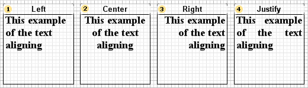
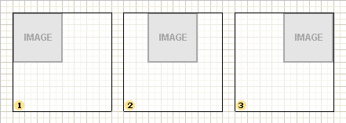
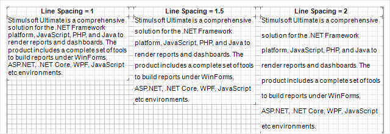

## Horizontal Alignment

Some components allow you to set alignment of their content in relation to their sizes horizontally. For example, the Text, the Image components. Horizontal alignment defines the design of content and can be carried out by the left edge, the right edge, in the center or width (only for some text). To change alignment you can use the Horizontal Alignment component property.

Horizontal alignment of text

Most of all, some text is aligned by the left edge. If you align by width, some text is aligned both by the left edge and the right edge at the same time. Text alignment by width allows you to get smooth text edges by sides. Below you can see the image with examples of all four kinds of alignment.

 Left

The text is aligned in relation to the right border of a component.

 Center

The text is aligned in the center in relation to the left and right border of a component.

 Right

The text is aligned in relation to the right border of a component.

 Justify

The text is defined evenly by all justify of a component to get smooth edges of text by sides.

**Horizontal alignment of an image**

To control alignment horizontally for the Image component you should use the property you use for the Text component – Horizontal Alignment. An image is aligned only if the Strech property is set to true. Otherwise, alignment parameters will be ignored.

 Left

The image is aligned relatively to the right component border.

 Center

The image is aligned in the center relatively to the left and right component border.

 Right

The image is aligned relatively to the right component border.
**Line spacing**
Line spacing is a vertical distance between text rows.

To change line distance you should:
* Select a text component in a report;
* Using a control on the Home Ribbon tab in the report designer, select a value of line spacing;
* Or set a value of spacing for the Line Spacing property in the property panel in the report designer.
