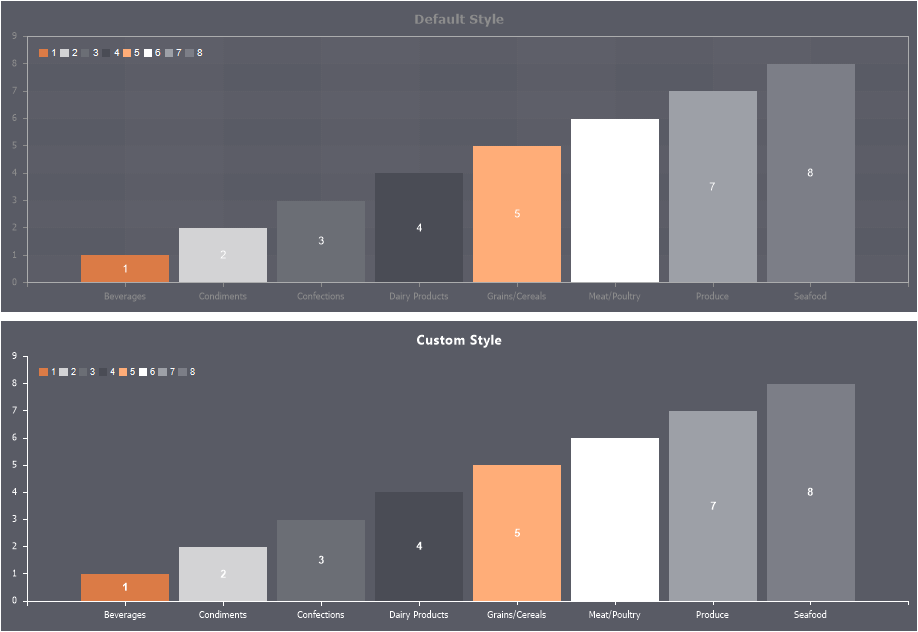

## Chart Style

The Chart Style type is applied to the [Chart component](../../../Reports_Internals/Charts/Editor/index.md) in the report and to the [Chart element](../../../Dashboards/Chart.md) on the dashboard. To create a chart style, follow these steps:

* In the style designer, click the Add Style button and select the Chart style.

* Use the style properties to customize the formatting.

* Apply the style to the [report components](index.md#applystyle) or [dashboard elements](../../../Dashboards/Appearance.md#ApplyStyle)..

> **Information**
>
> It is not possible to edit the preset Chart Styles. However, it is possible to create a custom style based on the preset style and adjust it. To do this, please follow these steps:
>
> Assign the preset style to the Chart component or element and select that component.
>
> Call up the Style Designer and click the [Get Style from Selected Components](Style_Designer.md#GetStyleFromSelectedComponents) button.
>
> Adjust the obtained style using its properties.
>
> Assign this custom style to the Chart component or element.

Below is a list of the properties used to configure the style of the chart.

> **Information**
>
> To apply formatting settings, it is necessary to consider the values of the Allow Use... properties.

Name

Description

Name

Sets the name of the current style.

Description

Specifies a description for the current style.

Collection Name

Adds an existing style to the [style collection](Style_Collections.md) or create a new style collection.

Conditions

Sets the conditions for [conditions for applying the current style](Style_Conditions.md) if it is included in the styles collection.

Axis Labels Color

Sets the color of the X and Y axis labels.

Axis Line Color

Sets the line color of the X and Y axis.

Axis Title Color

Sets the color of the X and Y axis titles.

Basic Style Color

Specifies the main color of the chart. This color will be used in chart elements that do not have color settings in the style.

Border

Changes the color, style, type, size of the borders of the Chart component. You can also enable the display of component border shadows.

Brush

Specifies the brush type and fill color for the area of the Chart component.

Brush Type

Specifies the brush type of the graphic elements of the chart.

Chart Area Border Color

Sets the border color of the chart area.

Chart Area Brush

Specifies the type of brush and sets the color of the chart area.

Chart Area Show Shadow

Enables/disables the chart area shadows. If the property is set to True, then chart area shadows will be displayed. If the property is set to False, then the shadows of the chart area will not be displayed.

Grid Lines Horizontal Color

Sets the color of the horizontal grid lines in the chart area. In order for the lines not to be displayed, select a color identical to the color of the area or select a transparent color.

Grid Lines Vertical Color

Sets the color of the vertical grid lines in the chart area. In order for the lines not to be displayed, select a color identical to the color of the area or select a transparent color.

Interlacing Horizontal Brush

Specifies the brush type and sets the horizontal interlacing color. To disable the horizontal striping, set the Interlacing Horizontal Brush property to None.

Interlacing Vertical Brush

Specifies the brush type and sets the vertical interlacing color. To disable the vertical striping, set the Interlacing Vertical Brush property to None.

Legend Border Color

Sets the color of the legend borders. In order to disable the border of the legend, select a transparent color.

Legend Brush

Specifies the brush type and fill color of the chart legend.

Legend Labels Color

Sets the color of the legend labels.

Legend Title Color

Sets the color of the legend title. By default, the legend title is empty, disabled.

Marker Visible

Enables or disables markers on the chart.

Series Border Thickness

Specifies the border thickness of the graphic element in pixels. By default, it is set to 1.

Series Corner Radius

Defines the rounding radius of the series graphic elements. You can round off each corner of the row graphic element separately: Top - Left, Top - Right, Bottom - Right, Bottom - Left. The property can be set to a value from 0 to 30, where 0 is no rounding angle and 30 is the maximum value of the rounding radius.

Series Labels Border Color

Sets the series labels border color.

Series Labels Brush

Defines the brush type and sets the fill color for series titles or chart value labels.

Series Labels Color

Sets the color of series labels or chart value labels.

Series Labels Line Color

Sets the color of the line from graphic elements to series labels or chart value labels.

Series Lighting

Enables/disables highlighting the border of a circular or circular row. If the property is set to True, then row illumination will be enabled. If the property is set to False, then row illumination will be disabled.

Show Series Border

Shows the border of the graphical elements of the series or. If the property is set to True, then the border of the graphic elements of the series will be enabled. If the property is set to False, then the border of the series graphic elements will be disabled.

Series Show Shadow

Enables or disables the display of series shadows. If the property is set to True, then the shadows of the series graphical elements will be enabled. If the property is set to False, then the shadows of the series graphical elements will be disabled.

Style Colors

Creates a [collection of style colors](Style_Designer.md#StyleColors). These colors are applied sequentially to the graphics objects in the series.

If the Color Each parameter is enabled for rows, then colors from the collection will be applied to graphic elements first. Then, shades for other graphic elements will be obtained by lightening these colors.

Trend Line Color

Sets the color of the trend line. This property is relevant if the chart uses a trend line.

Trend Line Show Shadow

Enables/disables the display of the trend line shadow. If the property is set to True, then the shadow of the trend line will be enabled. If the property is set to False, then the shadow of the trend line will be disabled.

Allow Use Border Format

Specifies whether [border formatting](../Borders.md) is applied from the assigned style or from the properties of a component. If the property is set to True, then the component's border formatting settings will be taken from the current style. If the current property is set to False, then the border formatting settings will be determined by the properties of the component.

Allow Use Border Sides

Allows using [borders](../Borders.md) from an assigned style or from component properties. If the property is set to True, then the settings for including the component's borders will be obtained from the current style. If the current property is set to False, then the settings for including borders will be determined by the properties of the component.

Allow Use Brush

Allows [the brush and background color](../Background_Brushes.md) to be applied from the assigned style or from the component's properties. If the property is set to True, then the component's background fill settings will be taken from the current style. If the current property is set to False, then the settings for filling the background will be determined by the properties of the component.
