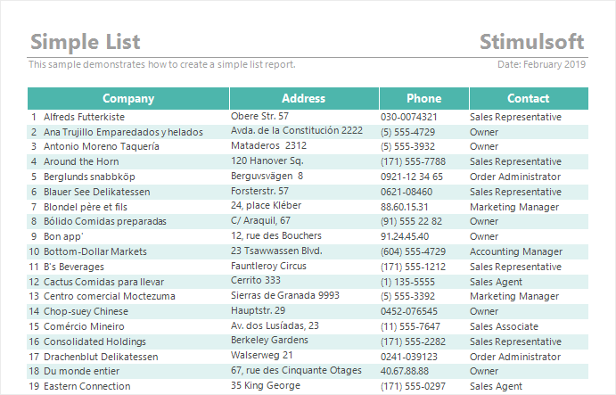

## Component Style

The **Component** Style is applied to all report components that do not have a specific style. For example, for bands, text components, panels, images, etc. To create a component style, do the following:

* Click the **Add Style** button in the **Style Designer** and select the **Component** style.

* Configure the formatting settings using the style properties.

* Apply the style to [report components](index.md#applystyle) or [dashboard elements](../../../Dashboards/Appearance.md#ApplyStyle).

Below is a table of properties that are used to set the style of the component.

> **Information**
>
> To apply the appearance settings, you should consider the values of the **Allow Use..**. properties.

| **Name** | **Description** |
| --- | --- |
| Name | Sets the name of the current style. |
| Description | Specifies a description for the current style. |
| Collection Name | Adds an existing style to the [style collection](Style_Collections.md) or create a new style collection. |
| Conditions | Sets the conditions for [conditions for applying the current style](Style_Conditions.md) if it is included in the styles collection. |
| Border | A group of properties that can be used to set the [borders of a component](../Borders.md), their style, color, size, as well as enable or disable the shadow display. In addition, the group header has a Browse button, when clicked, the border editor will be called. |
| Brush | A group of properties that allows you to select [the brush type and fill color](../Background_Brushes.md)  for the component's background. |
| Font | A group of properties that allows you to select [a font, define its style and size](../Fonts_and_Font_Brushes.md), for the text of a component. |
| Horizontal Alignment | Selects [the horizontal alignment](../Horizontal_Alignment.md) of the text: Left, Center, Right, Width. |
| Image | Loads an image into the style. To do this, click the Browse button in the current property value field. After that, the image editor will be called. Load the image there. Then, when applying the current style to the Image component, the loaded image will be passed to it. |
| Line Spacing | Specifies line spacing for text. The default value is 1. |
| Negative Text Brush | A group of properties that is used to select [the brush type and text color](../Background_Brushes.md) of negative values. |
| Text Brush | A group of properties that is used to select [the brush type and text color](../Background_Brushes.md) of a value. |
| Text Format | Changes [format](../../Text_Formatting/index.md) of component values. When you click the Browse button in the value field of the current property, the value format editor will be called. |
| Vertical Alignment | Selects the [vertical alignment](../Vertical_Alignment.md) of the text: **Top**, **Center**, **Bottom**. |
| Allow Use Border Formatting | Allows applying [border formatting](../Borders.md) from the assigned style or from the properties of a component. If the property is set to True, then the component's border formatting settings will be taken from the current style. If the current property is set to False, then the border formatting settings will be determined by the properties of the component. |
| Allow Use Border Sides | Allows enabling [borders](../Borders.md) from the assigned style or from the properties of the component. If the property is set to True, then the settings for including the component's borders will be obtained from the current style. If the current property is set to False, then the settings for enabling borders will be determined by the properties of the component. |
| Allow Use Border Sides from Location | Allows the ability to take the component's position relative to the parent container into account when enabling borders. If the property is set to **True**, the following algorithm is used: if the component touches the edge of the parent container on any side, a border is applied on that side, regardless of whether the parent has a border on that side. If the property is set to **False**, enabling borders will not take the **Location** style condition into account. |
| Allow Use Brush | Allows applying [the brush and the background color](../Background_Brushes.md) from the assigned style or from the properties of the component. If the property is set to **True**, then the component's background fill settings will be obtained from the current style. If the current property is set to **False**, then the background fill settings will be determined by the properties of the component. |
| Allow Use Font | Allows applying [the text font](../Fonts_and_Font_Brushes.md) from the assigned style or from the properties of the component. If the property is set to **True**, then the font settings for the component's text will be obtained from the current style. If the current property is set to **False**, then the font settings for the component's text will be determined by the properties of this component. |
| Allow Use Horl Alignment | Allows applying [horizontal alignment](../Horizontal_Alignment.md) from the assigned style or from the component's properties. If the property is set to **True**, then the horizontal alignment settings for the component's content will be obtained from the current style. If the current property is set to **False**, then the horizontal alignment settings for the component's content will be determined by the component's properties. |
| Allow Use Image | Allows applying an image from the assigned style or from the component's sources. If the property is set to **True**, then the image for the Image component will be obtained from the current style. If the current property is set to **False**, then the image for the **Image** component will be obtained from its sources. |
| Allow Use Negative Text Brush | Enables [the brush and text color](../Background_Brushes.md) to be applied to negative ones from the assigned style. If the property is set to **True**, then negative values will use the color of negative values from the current style. If the current property is set to **False**, then negative values will use the text color or another color defined by the component's properties. |
| Allow Use Text Brush | Enables [the brush and text color](../Background_Brushes.md) to be applied from the assigned style or from the component's properties. If the property is set to **True**, then the brush settings and the component's text color will be obtained from the current style. If the current property is set to **False**, then the brush and text color settings will be determined by the properties of the component. |
| Allow Use Text Format | Enables [value formatting](../../Text_Formatting/index.md) to be applied from the assigned style or from the component's properties. If the property is set to **True**, then the component value formatting settings will be taken from the current style. If the current property is set to **False**, then the value formatting settings will be determined by the properties of the component. |
| Allow Use Vert Alignment | Enables [vertical alignment](../Vertical_Alignment.md) to be applied from the assigned style or from the component's properties. If the property is set to **True**, then the vertical alignment settings of the component's content will be obtained from the current style. If the current property is set to **False**, then the vertical alignment settings of the component's content will be determined by the properties of the component. |
