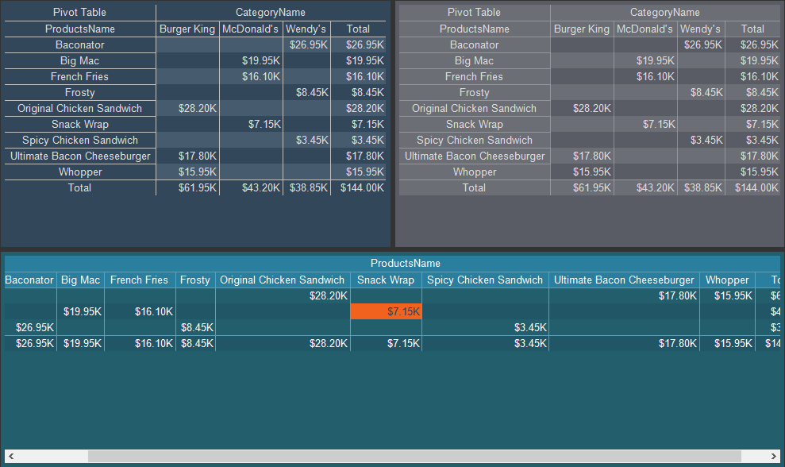

## Cross-Tab Style

The Cross-Tab style is applied to the [Cross-Tab](../../CrossTable/index.md) component and [Pivot Table](../../../Dashboards/Pivot_Table.md) element. To create a cross-tab style you should do the following:
* In the style designer, click the Add Style button and select the Cross-Tab style.

* Use the style properties to customize the formatting.

* Apply the style to the [report components](index.md#applystyle) or [dashboard elements](../../../Dashboards/Appearance.md#ApplyStyle).

> **Information**
>
> It is not possible to edit the preset Cross-Tab styles. However, it is possible to create a custom style based on the preset style and adjust it. To do this, please follow these steps:
>
> * Assign the preset style to the Cross-Tab component or element and select that component.
>
> * Call up the Style Designer and click the [Get Style from Selected Components](Style_Designer.md#GetStyleFromSelectedComponents) button.
>
> * Adjust the obtained style using its properties.
>
> * Assign this custom style to the Cross-Tab component or Pivot Table element.

Below is a table of properties that are used to customize the crosstab style.

Name

Description

Name

Sets the name of the current style.

Description

Specifies a description for the current style.

Collection Name

Adds an existing style to the [style collection](Style_Collections.md) or create a new style collection.

Conditions

Sets the conditions for [conditions for applying the current style](Style_Conditions.md) if it is included in the styles collection.

Alternating Cell Back Color

Changes the background color of odd cells in a component or element.

Alternating Cell Fore Color

Changes the text color of odd cells in a component or element.

Back Color

Changes the background color of a component or element.

Cell Back Color

Changes the background color of cells.

Cell Fore Color

Changes the text color in cells.

Column Header Back Color

Changes the background color of the column headers.

Column Header Fore Color

Changes the color of the text in the column headers.

Hot Column Header Back Color

Selects the background color of the column headers when hovering over.

Hot Row Header Back Color

Selects the background color of row headers when hovering over.

Line Color

Selects the color of the grid lines.

Row Header Back Color

Changes the background color of row headers.

Row Header Fore Color

Changes the text color of row headers.

Selected Cell Back Color

Selects the background color of cells when they are selected in a rendered report or on the dashboard.

Selected Cell Fore Color

Selects the text color of cells when they are selected in a rendered report or on the dashboard.

Total Cell Column Back Color

Changes the background color of the resulting (total) cells for the columns of a component or element.

Total Cell Column Fore Color

Changes the color of the text in the resulting (total) cells of the columns of a component or element.

Total Cell Row Back Color

Changes the background color of the result (total) cells for component or element rows.

Total Cell Row Fore Color

Changes the text color in the resulting (total) cells of the rows of a component or element.
