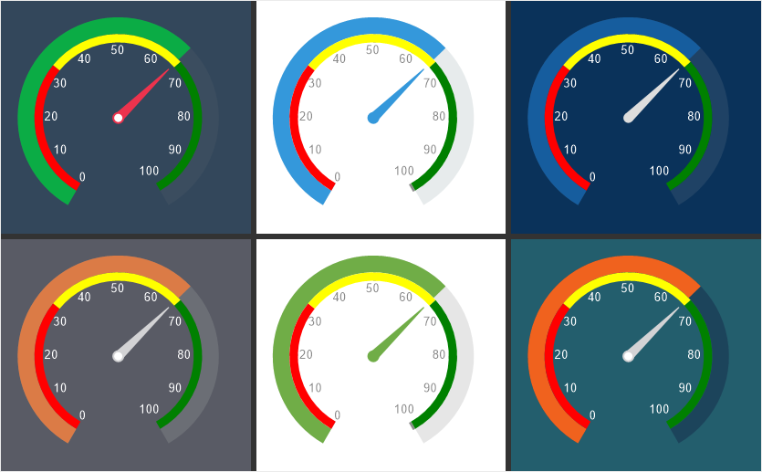

## Gauge Style

The Gauge Style is applied to the gauge component and element in the report and on the dashboard panel. To create a gauge style, follow these steps:

* In the style designer, click the Add Style button and select the Gauge style.

* Use the style properties to customize the formatting.

* Apply the style to the [report components](index.md#applystyle) or [dashboard elements](../../../Dashboards/Appearance.md#ApplyStyle).

> **Information**
>
> It is not possible to edit the preset Gauge styles. However, it is possible to create a custom style based on the preset style and adjust it. To do this, please follow these steps:
>
> Assign the preset style to the Gauge component or element and select that component.
>
> Call up the Style Designer and click the [Get Style from Selected Components](Style_Designer.md#GetStyleFromSelectedComponents) button.
>
> Adjust the obtained style using its properties.
>
> Assign this custom style to the Gauge component or element.

Below is a list of the properties used to configure the style of the chart.

Name

Description

Name

Sets the name of the current style.

Description

Specifies a description for the current style.

Collection Name

Adds an existing style to the [style collection](Style_Collections.md) or create a new style collection.

Conditions

Sets the conditions for [conditions for applying the current style](Style_Conditions.md) if it is included in the styles collection.

Border Color

Changes the border color of a component or element.

Border Width

Sets the width of borders of elements.

Brush

Changes the brush and fill color of the background of a component or element.

Fore Color

Specifies the text color for the titles of an element row.

Linear Bar Border Brush

A group of properties that changes the brush and stroke color of the linear scale. Actual if the value of the Border Width property is enabled.

Linear Bar Brush

A group of properties that changes the brush and fill color of the linear scale background for the Bullet type.

Linear Bar Empty Border Brush

A group of properties that changes the brush and stroke color of the unfilled area of the linear scale. Actual if the value of the Border Width property is enabled.

Linear Bar Empty Brush

A group of properties that changes the brush and background fill color of the unfilled area of a linear scale.

Linear Scale Brush

A group of properties that change the brush and fill color of the linear scale.

Marker Brush

A group of properties that change the brush and fill color of the marker on a linear scale.

Needle Border Brush

A group of properties that change the brush and fill color of the needle border.

Needle Border Width

A group of properties that change the border width of the needle.

Needle Brush

A group of properties that change the brush and background fill color of the needle.

Needle Cap Border Brush

A group of properties that change the brush and fill color of the needle cap.

Needle Cap Brush

A group of properties that change the brush and background fill color of the needle cap.

Radial Bar Border Brush

A group of properties that change the brush and fill color of the radial bar.

Radial Bar Brush

A group of properties that change the brush and fill color of the background of the radial scale.

Radial Bar Empty Border Brush

A group of properties that change the brush and stroke color of the unfilled area of the radial scale.

Radial Bar Empty Brush

A group of properties that change the brush and background fill color of the unfilled area of the radial scale.

Target Color

Changes the display color of the label and label for the element target value.

Tick Label Major Font

A group of properties that change the font, its size and style, for the labels of the major values of the meter scale.

Tick Label Major Text Brush

A group of properties that change the brush and color of the labels of the meter scale major values.

Tick Label Minor Font

A group of properties that change the font, font size and style for the labels of the minor values of the meter scale.

Tick Label Minor Text Brush

A group of properties that change the brush and color of the meter's tick minor value captions.

Tick Mark Major Border

A group of properties that change the brush and stroke color of major tick marks.

Tick Mark Major Border Width

Changes the border thickness of the main tick mark on the gauge scale.

Tick Mark Major Brush

A group of properties that change the brush and background fill color of the major tick marks.

Tick Mark Minor Border

A group of properties that change the brush and stroke color of minor tick marks.

Tick Mark Minor Border Width

Changes the border thickness of the minor tick mark on the gauge scale.

Tick Mark Minor Brush

A group of properties that change the brush and background fill color of the minor tick marks.
