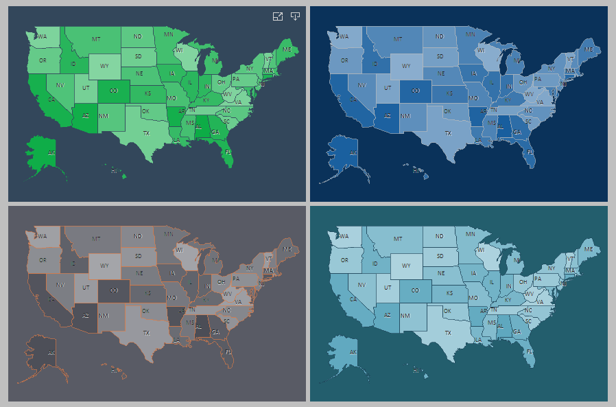

## Map Style

The Map style type is applied to the [Map component](../../Maps/index.md) and [Regional Map](../../../Dashboards/Maps/Region_Map.md) element. To create a map style, follow these steps:
* In the style designer, click the Add Style button and select the Map style.

* Use the style properties to customize the formatting.

* Apply the style to the [report components](index.md#applystyle) or [dashboard elements](../../../Dashboards/Appearance.md#ApplyStyle).

> **Information**
>
> It is not possible to edit the preset Map styles. However, it is possible to create a custom style based on the preset style and adjust it. To do this, please follow these steps:
>
> * Assign the preset style to the Map component or element and select that component.
>
> * Call up the Style Designer and click the [Get Style from Selected Components](Style_Designer.md#GetStyleFromSelectedComponents) button.
>
> * Adjust the obtained style using its properties.
>
> * Assign this custom style to the Map component or Regional Map element.

Below is a list of properties used to configure the Map style.

Name

Description

Name

Sets the name of the current style.

Description

Specifies a description for the current style.

Collection Name

Adds an existing style to the [style collection](Style_Collections.md) or create a new style collection.

Conditions

Sets the conditions for [conditions for applying the current style](Style_Conditions.md) if it is included in the styles collection.

Back Color

Changes the background color of a component or element.

Border Color

Changes the border color of the map segments.

Border Size

Changes the border thickness of the map segments.

Bubble Back Color

Changes the color of the value bubbles on the map.

Bubble Border Color

Changes the border color of value bubbles on the map.

Colors

Customizes the list of colors for maps. Clicking the Browse button will open the color collection editor.

Default Color

Changes the default color. For example, this color will be used in maps with a group, and will be applied to map segments that are not part of any group.

Heatmap Color

A group of properties used to set up a list of colors for a heat map. You can define the color of the maximum value and the color of zero, as well as the dimming or brightening mode of the thermal indication.

Heatmap with Group

A group of properties used to set up a list of colors for a grouped heatmap. You can define the colors of the maximum values and the color of the zero, as well as the dimming or brightening mode of the heat indication.

Individual Color

Sets the color of individual map segments.

Label Foreground

Changes the color of text on map segments.

Label Shadow Foreground

Changes the text shadow color on map segments. In order for the shadow not to be displayed, you should select the Transparent color.
