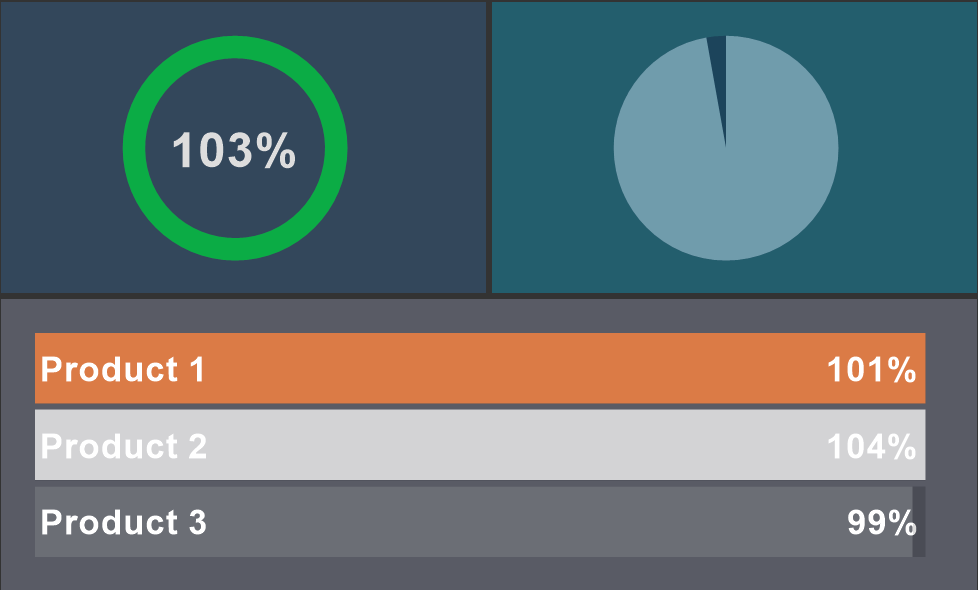

## Progress Style

The Progress style is applied to the [Progress](../../../Dashboards/Progress.md) element. In order to create a progress style, you should:
* In the style designer, click the Add Style button and select the Progress style.

* Use the style properties to customize the formatting.

* Apply the style to the [report components](index.md#applystyle) or [dashboard elements](../../../Dashboards/Appearance.md#ApplyStyle).

> **Information**
>
> It is not possible to edit the preset Indicator styles. However, it is possible to create a custom style based on the preset style and adjust it. To do this, please follow these steps:
>
> * Assign the preset style to the Indicator component or element and select that component.
>
> * Call up the Style Designer and click the [Get Style from Selected Components](Style_Designer.md#GetStyleFromSelectedComponents) button.
>
> * Adjust the obtained style using its properties.
>
> * Assign this custom style to the Indicator component or element.

Below is a list of properties that are used to set the progress style.

Name

Description

Name

Sets the name of the current style.

Description

Specifies a description for the current style.

Collection Name

Adds an existing style to the [style collection](Style_Collections.md) or create a new style collection.

Conditions

Sets the conditions for [conditions for applying the current style](Style_Conditions.md) if it is included in the styles collection.

Back Color

Changes the background color of an element.

Band Color

Changes the background color of the filled area of a graphical object of an element.

Fore Color

Changes the text color of an element.

Series Color

Creates a collection of colors that will be used as the background of cards when the Color Each mode is enabled.

Track Color

Changes the background color of an empty area of a widget of the element.
