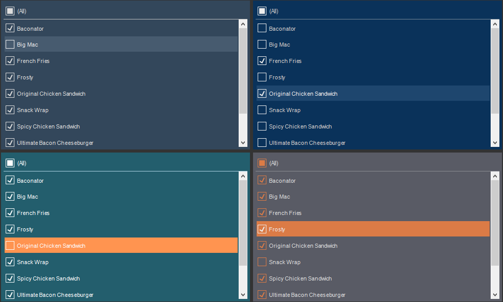

## Report Control Style

The **Report Control** style applies to forms and controls in a report, as well as to [filter elements](../../../Dashboards/Data_Filtering/index.md) and the [Button](../../../Dashboards/Button.md) element in the dashboard. To create a style for a control, you should do the following:
* In the style designer, click the **Add Style** button and select the **Report Control** style.

* Use the style properties to customize the formatting.

* Apply the style to the [report components](index.md#applystyle) or [dashboard elements](../../../Dashboards/Appearance.md#ApplyStyle).

> **Information**
>
> It is not possible to edit the preset **Report Control** styles. However, it is possible to create a custom style based on the preset style and adjust it. To do this, please follow these steps:
>
> * Assign the preset style to the **Report Control** component or element and select that component.
>
> * Call up the Style Designer and click the [Get Style from Selected Components](Style_Designer.md#GetStyleFromSelectedComponents) button.
>
> * Adjust the obtained style using its properties.
>
> * Assign this custom style to the **Report Control** component or element.

Below is a list of properties that are used to set the report control style.

| **Name** | **Description** |
| --- | --- |
| Name | Sets the name of the current style. |
| Description | Specifies a description for the current style. |
| Collection Name | Adds an existing style to the [style collection](Style_Collections.md) or create a new style collection. |
| Conditions | Sets the conditions for [conditions for applying the current style](Style_Conditions.md) if it is included in the styles collection. |
| Back Color | Changes the background color of an element. |
| Font | A group of properties that is used to change the font, its size, and style for the text of controls or filter elements. |
| Fore Color | Changes the text color of the values. |
| Glyph Color | Changes the color of value icons. |
| Hot Back Color | Changes the background color of element values when hovering over in the viewer. |
| Hot Fore Color | Change the text color of the values of the element when the cursor is hovered over the element in the viewer. |
| Hot Glyph Color | Changes the color of the element value icon when the cursor is hovered over the element in the viewer. |
| Hot Selected Back Color | Changes the background color of the element values when this value is selected in the viewer. |
| Hot Selected Fore Color | Changes the text color of the element values when this value is selected in the viewer. |
| Hot Selected Glyph Color | Changes the color of an element value icon when the value is selected in the viewer. |
| Selected Back Color | Changes the background color of an element selected value. |
| Selected Fore Color | Changes the text color of an element selected value. |
| Selected Glyph Color | Changes the icon color of an element highlighted value. |
| Separator Color | Changes the color of an element value separator. |
| Allow Use Back Color | Determines permission to apply a background color from an assigned style or from element properties. If the property is set to **True**, then the element background fill settings will be derived from the current style. If the current property is set to **False**, then the background fill settings will be determined by the properties of the element. |
| Allow Use Font | Determines permission to apply a text font from an assigned style or from an element properties. If the property is set to **True**, then the font settings for the element text will be obtained from the current style. If the current property is set to **False**, then the font settings for the element text will be determined by the properties of this element. |
| Allow Use Fore Color | Determines permission to apply text color from an assigned style or from an element properties. If the property is set to **True**, then the element text color settings will be derived from the current style. If the current property is set to **False**, then the text color settings will be determined by the properties of the element. |
