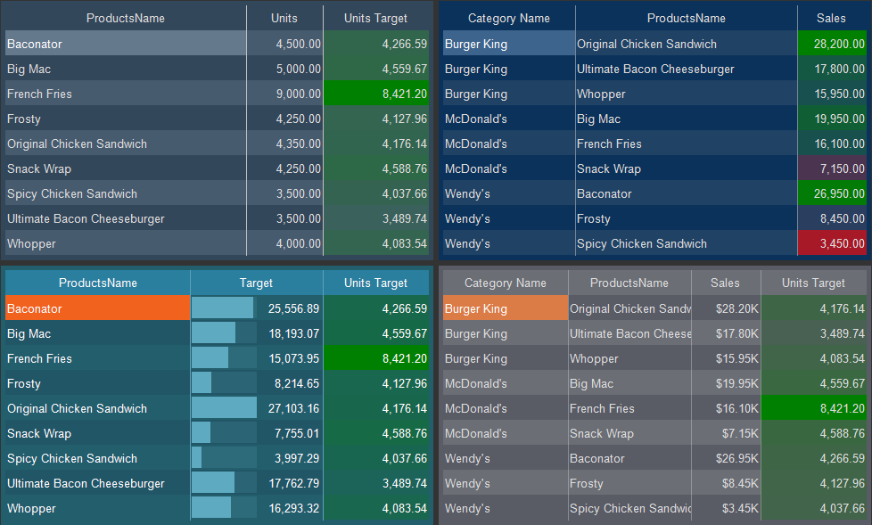

## Table Style

The Table style applies to the [Table](../../Table/index.md) component and [Table](../../../Dashboards/Table.md) element. You should do the following to create a table style:
* In the style designer, click the Add Style button and select the Table style.

* Use the style properties to customize the formatting.

* Apply the style to the [report components](index.md#applystyle) or [dashboard elements](../../../Dashboards/Appearance.md#ApplyStyle).

> **Information**
>
> It is not possible to edit the preset Table styles. However, it is possible to create a custom style based on the preset style and adjust it. To do this, please follow these steps:
>
> Assign the preset style to the Table component or element and select that component.
>
> Call up the Style Designer and click the [Get Style from Selected Components](Style_Designer.md#GetStyleFromSelectedComponents) button.
>
> Adjust the obtained style using its properties.
>
> Assign this custom style to the Table component or element.

Below is a list of properties that are used to customize the table style.

Name

Description

Name

Sets the name of the current style.

Description

Specifies a description for the current style.

Collection Name

Adds an existing style to the [style collection](Style_Collections.md) or create a new style collection.

Conditions

Sets the conditions for [conditions for applying the current style](Style_Conditions.md) if it is included in the styles collection.

Alternating Data Color

Changes the background color of the odd rows of a component or element.

Alternating Data Foreground

Changes the text color of the odd lines of a component or element.

Back Color

Changes the background color of a component or element.

Data Color

Changes the background color of table cells.

Data Foreground

Changes the text color in cells.

Footer Color

Changes the background color of the footer cells.

Footer Foreground

Changes the text color in footer cells

Grid Color

Changes the color of grid lines in a table.

Header Color

Changes the background color of table headers.

Header Foreground

changes the color of text in table headers.

Hot Header Color

changes the background color of the table headers when hovering over.

Selected Data Color

Changes the background color of value cells when they are selected in a rendered report or on the dashboard.

Selected Data Foreground

Changes the text color of values when they are selected in a rendered report or on the dashboard.
