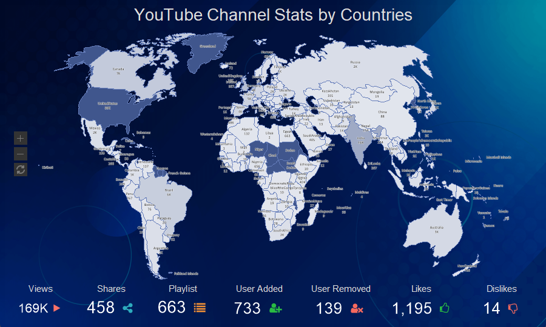

## Watermark Style

The **Watermark** style is applied to report template pages, dashboards, and also to the [Panel](../../../Dashboards/Panel.md) element. Do the next steps to create a component style:
* In the style designer, click the **Add Style** button and select the **Watermark** style.

* Use the style properties to customize the formatting.
* Apply the style by setting it as the value of the **Watermark Style** property for the template pages, dashboard, or **Panel** element on the dashboard.

Below is a list of properties that are used to set the watermark style.

> **Information**
>
> To apply the appearance settings, you should consider values of the **Allow Use...** properties.

| **Name** | **Description** |
| --- | --- |
| Name | Sets the name of the current style. |
| Description | Specifies a description for the current style. |
| Collection Name | Adds an existing style to the [style collection](Style_Collections.md) or create a new style collection. |
| Conditions | Sets the conditions for [conditions for applying the current style](Style_Conditions.md) if it is included in the styles collection. |
| Text | Defines the watermark text. |
| Text Angle | Defines the rotation angle of the watermark text. |
| Text Brush | A group of properties that is used to select [the brush type and text color](../Background_Brushes.md) of a value. |
| Text Enabled | Displays text for the watermark. |
| Text Font | A group of properties that allows you to select [a font, define its style and size](../Fonts_and_Font_Brushes.md), for the watermark text. |
| Text Right to Left | Enables the Right-to-Left mode for watermark text. |
| Show Text Behind | Displays text in a watermark in the foreground or background. |
| Image | Adds an image for the watermark. |
| Image Alignment | Defines the alignment of an image on a page, dashboard, or panel. |
| Image Aspect Ratio | Enables the mode to save the proportions of the width to the height of the image. |
| Image Enabled | Enables or disables the image in the watermark. |
| Image Multiple Factor | Changes the scale of the image. |
| Show Image Behind | Displays an image in the foreground or background of the watermark. |
| Image Stretch | Stretches an image to fit the entire page, dashboard, or panel on a dashboard. |
| Image Tiling | Enables the mode to fill the entire page, dashboard or panel with repeated images. |
| Image Transparency | Sets the coefficient (between 0 and 1) for the transparency of an image, where 0 is an opaque image and 1 is a completely transparent one. |
| The following style properties are only relevant for the dashboard and the **Panel** element on the dashboard panel. They do not apply to report pages. |  |
| Weave Angle | Defines the rotation angle of weave icons. |
| Weave Distance | Defines the spacing between weave icons. |
| Weave Enabled | Enables or disables weave in the watermark. |
| Weave Major Color | Defines the color of basic weave icons. |
| Weave Major Icon | Defines an icon for basic weaves. |
| Weave Major Size | Defines the size of basic weave icons. |
| Weave Minor Color | Defines the color of additional weave icons. |
| Weave Minor Icon | Defines an icon for additional weaves. |
| Weave Minor Size | Defines the size of additional weave icons. |
