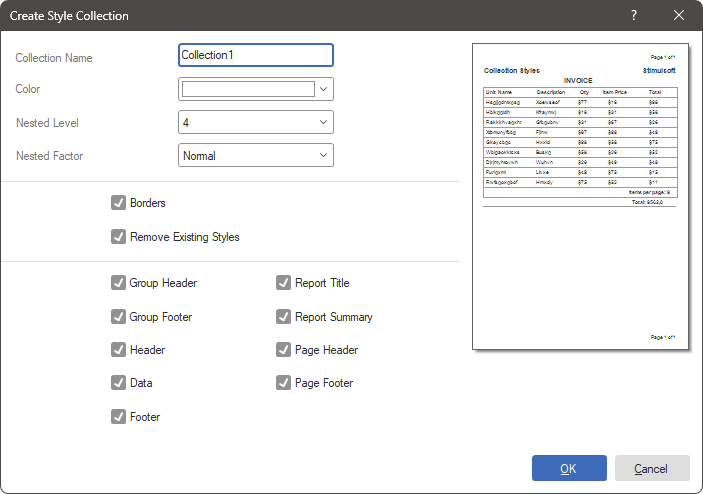

## Collections

A style collection is a group of styles that have the same value in the **Collection Name** property. Each collection must contain at least one style. For instance, if multiple styles are used in a report, they can be combined into a collection. It's important to note that a report can have multiple style collections.

You can create a style collection in the following ways:

* Manually, by assigning the same value to the **Collection Name** property of the required styles.

* By selecting the **Create Style Collection...** command from the **Actions** menu, defining the settings for the new collection, and clicking the Ok button. In this case, the collection will be generated automatically.

It's worth noting that a report can contain both manually created style collections and automatically generated ones. Additionally, if needed, the styles within a generated collection can be edited along with the collection itself.

You can apply styles from collections in the following ways:

* Manually assign a style to each report or report component. You can select from the drop-down menu of quick style selections or from the drop-down list of values for the **Style** property.

* Select the style collection from the quick style select menu on the **Home** tab of the Ribbon panel in the style designer.

> **Information**
>
> It's worth noting that when selecting a style collection, all styles within that collection will be applied according to their conditions. If conditions are not set, then all styles from the collection will be applied to all report components in sequence. As a result, the last style in the collection will be applied to the report components.

It's also important to note that only one style collection can be applied to report components at a time. However, in some cases, you can manually assign a different style to specific report components while applying a collection of styles to the rest of the report. Let's take a look at some examples of creating style collections.

**Creating a Style Collection Manually**

Creating a style collection manually involves filling in the **Collection Name** property or dragging a style into the collection.

**Step 1**: Launch the style designer.

**Step 2**: Create styles or open a previously saved style file.

**Step 3**: To create a style collection, fill in the **Collection Name** property for the required styles. The name of the future collection is specified as the value of this property. Each unique value specified in this property creates a new collection. For example, if you specify the name Black for five styles, then the Black collection will be formed in the list of elements of the style designer, containing these five styles.

When working with style collections, keep in mind:

* When dragging a style from one collection to another, the value of the **Collection Name** property will change accordingly.

* If you rename a style collection, all styles within that collection will have their **Collection Name** property value changed as well.

* To remove a style from any collection, delete the value of the **Collection Name** property by leaving the value field of this property blank.

**Step 4**: Set up style conditions. Without conditions, when applying a collection of styles to a report, the styles will be applied sequentially from top to bottom. As a result, the last style from the collection will be applied to the report. However, you can also change the style of a report component by selecting it in the report template and choosing the appropriate style from the style menu on the **Home** tab of the report designer.

**Step 5**: Define the style's appearance options, such as brush, color, border, alignment, etc.

**Step 6**: Click the **Ok** button in the style designer to save the new style or the modifications to the existing one.

**Creating a generated style collection**

Creating a generated style collection involves creating a collection of styles automatically.

**Step 1**: Run the style designer.

**Step 2**: Select the **New Style Collection...** command from the **Actions** menu of the style designer;

**Step 3**: Define the parameters of the future style collection:

 The **Collection Name** field specifies the name of the collection.

 The **Color** parameter is used to select the primary color for the style collection.

 The **Nested Level** is used to select a value corresponding to the nesting level in the report. More details will be discussed below.

 The **Nested Factor** parameter is used to define a nesting factor that affects the lightness of colors in a given style collection.

 An option is used to enable or disable **Borders** for the styles in the collection.

 The **Remove Existing Styles** option. If this option is enabled, then when creating a collection, existing styles and collections in the style designer will be deleted. If this option is disabled (the checkbox is unchecked), then the new style collection will be added to the already existing styles and collections.

 The **Components** panel. Report bands are marked on this panel. If a certain band is checked, then a style will be created that will be applied to the report components located on this band. If no band is checked, then the style collection will not be created.

 The **Preview** panel. This panel displays an example of a report with the styles collection being created applied to it.

**Step 4**: Click the Ok button in the **Create Style Collection** dialog.

**Step 5**: Edit the styles from the collection and click the **Ok** button in the style designer.

**Applying a style collection to a report**

After the style collections are created, you can select one of these collections in the report.

* To do this, click on the style quick selection menu in the report designer on the **Home** tab.

* The drop-down list will display all collections of reports and a list of styles.

* After selecting a collection, a message will be displayed asking you to confirm or cancel this action.

If confirmed, the styles from the collection will be applied to the report components depending on the specified [conditions](Style_Conditions.md) in these styles.
