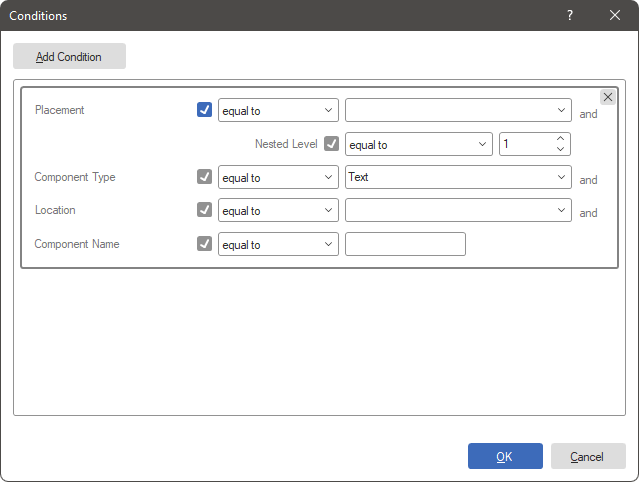
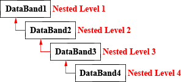
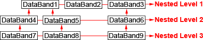
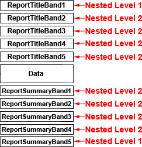

## Conditions

Styles are applied to report components:

* Manually. To do this, select a report component, select a style from the quick style selection menu on the **Home** tab, or select the desired style in the **Style** property of the component or element.

* Apply the collection to the report. In this case, the styles from the collection will be applied automatically, according to the specified conditions. If the styles in the collection do not have application conditions defined, then all styles from this collection will be applied to all components sequentially. As a result, the components will be assigned the latest style from the collection.

> **Information**
>
> To automatically apply a collection of styles to report components correctly, you need to define application conditions for each style in the collection.

To apply a collection of styles to report components automatically, it is necessary to define application conditions for each style in the collection. Otherwise, you can assign a style to components manually by selecting a report component or dashboard element and choosing a style from the list of **Style** property values or the quick style selection menu on the Ribbon panel of the report designer.

If you wish to use style application conditions, you can access the **Conditions** editor by following these steps:

* Select a style in the style designer.

* Click the **Browse** button next to the **Conditions** property on the property panel of the style designer.

> **Information**
>
> When creating a style collection in automatic mode using the **Create Style Collection...** command, the conditions in the styles will be included in the collection upon creation. In this case, the conditions for applying styles are determined by the settings specified during the creation of the collection.

**Condition editor**

Adding and setting conditions for applying a style from the collection is done in the **Conditions** editor. To add a block of conditions, click the **Add Condition** button. The condition block contains various logical conditions. These conditions can be set all together or separately. There may also be various combinations of conditions. To enable a logical condition, check the box next to its name. In order to ignore the logical condition, the checkbox must be unchecked.

Furthermore, you can add multiple condition blocks, which are processed sequentially from top to bottom. The first block that is processed is the one located above the others. If you want to change the sequence in which the condition blocks are processed, you can follow these steps:

* Select a block of conditions in the editor.

* Move the condition block up or down the list.

To delete a block of conditions, you need to follow these steps:

* Select a block of conditions in the editor.

* Click on the **Remove Condition** button.

 The **Placement** view condition is used to apply a style to a component depending on its position. Containers (bands, panel, table, page) are selected in the list of values.

* If the **equal to** operation is selected, then the style will be applied to the components placed on the selected containers.

* If the operation **not equal to** is selected, then the style will be applied to components placed on any containers, except for the values selected in the field.

 Condition of the **Nested Level** type. With this type of condition, you can apply a style to components depending on the level of nesting of containers at which the component is located. The value field specifies the nesting level of the container (maximum is 100). This condition type has the following operations:

* **equal to** - the style will be applied when the nesting level of the containers is equal to the level specified in the value field.

* **not equal to** - the style will be applied to all components in containers whose nesting level is not equal to the specified level in the values field.

* **greater than** - the style to be applied to components in containers whose nesting level is greater than the level specified in the value field.

* **greater than or equal to** - the style will be applied to components in containers whose nesting level is equal to or greater than the specified level in the value field.

* **less than** - the style will be applied to components in containers, the nesting level of which will be less than the level specified in the value field.

* **less than or equal to** - the style will be applied to components in containers whose nesting level will be equal to or less than the specified level in the value field.

 The **Component Type** view condition is used to apply a style only to components of a particular type. In the value field of this condition, you can simultaneously select several types of components. Under this condition, the following operations are available:

* **equal to** - the style will be applied to the components specified in the value field.

* **not equal to** - the style will be applied to all components, except for the values selected in the field.

 The **Location** view condition is used to apply a style to a component, depending on its location on the container. In the value field, the desired location of the component is selected. Operations available under this condition are:

* **equal to** - the style will be applied to all components, the location of which corresponds to the one selected in the value field.

* **not equal to** - the style will be applied to all components whose location is different than the one selected in the values field. Also note that you can select multiple locations at the same time in the value field.

 The **Component Name** type condition provides the ability to apply a style to a component with a specific name or part of it. In the value field, enter the name or part of the name of the component. When using this type of condition, the following types of operations are available:

* **equal to** - the style will be applied to a component with a name identical to that specified in the value field;

* **not equal to** - the style will be applied to all components, except for the one whose name matches the one specified in the value field;

* **containing** - the style will be applied to all components that contain the name or part of the name specified in the value field in their name.

* **not containing** - the style will be applied to all components that do not contain the name or part of the name specified in the value field in their name.

* **beginning with** - the style will be applied to all components whose name begins with the name specified in the value field.

* **ending with** - the style will be applied to all components whose name ends with the name specified in the value field.

**Nesting levels**

Nesting levels are commonly used in styling conditions. For example, you can specify that a style should only be applied to components that are at the third level of nesting, or to all components except for those at the second level of nesting. Additionally, when automatically generating collections of styles, it is important to have a clear understanding of nesting levels.

The level of nesting refers to the degree of subordination of one component to another component of the same type. The first level of nesting is established when a component is added to the report template. If you add a component and it has no subordination, it will be considered a component at the first nesting level.

> **Information**
>
> For instance, if a report contains two **Data** bands, with one being subordinate to the other, then the subordinate Data band will be considered a component of the second nesting level, while the other **Data** band will be a component of the first nesting level. Similarly, if the report has three **Data** bands, where the third is subordinate to the second and the second to the first, then they will respectively be components of the third, second, and first levels of nesting.
>
>
> It is important to note that there can be multiple components at the same nesting level. For example, several **Data** bands can be subordinate to a single parent **Data** band. However, it's not possible to create a nesting level between a **Data** band and a **Report Title** band, as these belong to different types of bands.

The example below illustrates the nesting levels of **Data** bands.

**Nesting levels of the Data band and bands related to it**

As mentioned earlier, when a component is added to a report template, it's automatically assigned to the first nesting level. However, you can change its nesting level by using the Master Component property. To do this, select the component and in the Master Component property field, choose the Data band to which it should be subordinate.

The nesting level of a subordinate band is determined by the nesting level of its parent Data band. For instance, if you choose a Data band that is at the third nesting level, the subordinate band will be assigned to the fourth nesting level. Moreover, it's important to note that multiple bands can be subordinate to a single parent Data band, in which case, they will all have the same nesting level. The example below illustrates a report organization scheme with three levels of nesting.

> **Information**
>
> It's worth noting that when creating a style collection in the **Create Style Collection** dialog, you can only specify a maximum nesting level of ten. However, by using a **Condition**, you can increase it up to the 100th nesting level.

The **Header**, **Footer**, **Group Header**, and **Group Footer** bands are directly related to the **Data** band, so their nesting level is determined by the nesting level of the DataBand to which they belong. It is essential to note that the nesting level of the Data band and its associated bands is independent of their position in the report.

**Nesting level of other bands**

For the **Report Title** and **Report Summary** bands, you can only create a collection of styles for the first and second levels of nesting. It is impossible to create a style collection for the third and subsequent levels of nesting for these bands. Unlike the **Data** band, subordination in this case is determined by the location of the bands on the report page, rather than by their nesting level.

* For the **Report Title** band, the nesting level is determined in the following way - the first (top) band is assigned the first nesting level, and all subsequent (lower) bands are assigned the second nesting level.

* For the **Report Summary** band, the order is slightly different - all bands, except for the last (low) one, are assigned the second level of nesting, while the last (low) band is assigned the first level.

The image below illustrates the nesting level distribution for the **Report Title** and **Report Summary** bands.

For the **Page Header** and **Page Footer** bands, you can create a collection of styles of only the first level of nesting.
