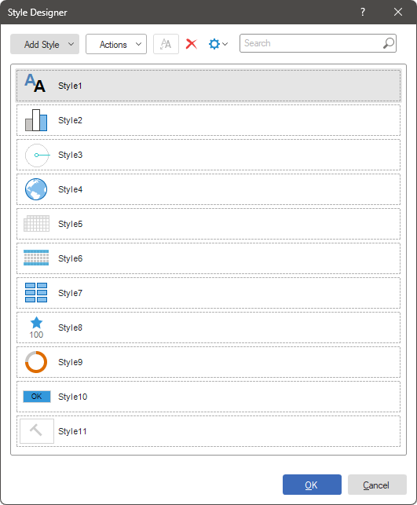
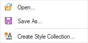
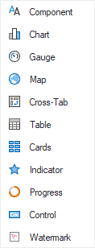

## Style Designer

The style designer is a tool designed for creating and editing styles for report components and dashboard elements. Styles can be grouped into collections, and all created styles and their collections can be saved to a file. Using styles and their collections, the visual formatting of the report is achieved.

In order to open the Style Designer, you should:

* Click on the Style Designer button on the Home ribbon tab in the report designer.

* Select Edit Styles from the Style property value list of the selected report component or dashboard element.

The Style Designer consists of:

* Toolbar, which contains menus and commands for managing styles.

* List of styles and collections.

Style customization is performed using its properties on the panel in the report designer.

Actions Menu
This menu contains the main commands for managing styles and style collections.

 The Open... command allows you to open a previously saved *.sts file containing styles and their collections.

 The Save As... command allows you to save the current list of styles and collections to a *.sts file.

 The Create Style Collection... command allows you to create a style collection automatically.

Add Style Menu
This menu contains commands for creating new styles.

 The [Component](Creating_Component_Style.md) Style type is applied to almost all report components that have the ability to select a style, with the exception of maps, charts, gauges, tables, cross-tabs, and controls. It is not applied to dashboardl elements.

 The [Chart](Creating_Chart_Style.md) Style type is applied to any type of chart in the report and on the dashboard.

 The [Gauge](Creating_Gauge_Style.md) Style type is applied to the Gauge component and element in the report and on the dashboard.

 The [Map](Creating_Map_Style.md) Style type is applied to the Map component in the report and to the Regional Map element on the dashboard.

 The [Cross-Tab](Creating_Cross-Tab_Style.md) Style type is applied to the Cross-Tab component in the report and to the Pivot Table element on the dashboard.

 The [Table](Creating_Table_Style.md) Style type is only applied to the Table component and element in the report and on the dashboard.

 The [Cards](Creating_Cards_Style.md) Style type is only applied to the Cards element on the dashboard.

 The [Indicator](Creating_Indicator_Style.md) Style type is only applied to the Indicator element on the dashboard.

 The [Progress](Creating_Progress_Style.md) Style type is only applied to the Progress element on the dashboard.

 The [Report Control](Creating_Report_Control_Style.md) Style type is applied to forms and their elements, as well as to filtering elements on the dashboard.

 The [Watermark](Creating_Watermark_Style.md) Style type is applied to the report template page, dashboard, and to the Panel element on the dashboard.

Get Style from Selected Components Command
The **Get Style from Selected Components** command allows creating a style with formatting settings of a selected report component (or multiple components) or a dashboard element (or multiple elements). To do this, follow these steps:

* Select a report component or a dashboard element.

* Open the style designer.

* Click the **Get Style from Selected Components** button on the toolbar of the style designer.
After that, a style of a specific type with formatting settings of the selected component or element will be created.
Filtering and sorting of styles
While working in the style designer, you have the option to disable the display of styles belonging to specific types. To do this, follow these steps:

* Click on the Settings button in the style designer.

* In the opened menu, check the types of styles that need to be displayed.
The reset of the display filters will occur:

* When creating a style which type is disabled;

* When restarting the style designer;

* If you go back to the settings menu and check a specific type of style.
In the settings menu, you can also define the sorting mode for styles and collections:

* Ascending, from A to Z.

* Descending, from Z to A.

* Sorting is disabled. In this case, styles and collections are not sorted, and they can be dragged and dropped in the list, changing the order.

Search Styles

The style designer has a search feature that allows you to search for styles. To do this, enter the name of the style or a part of its name in the Search field, and the list of styles will be automatically filtered.

Context Menu

The context menu contains duplicate commands from the toolbar, commands for working with the clipboard, and others. Depending on the selected object - style or collection, the commands in the context menu may differ. For example, the Style context menu in the style designer contains commands for creating styles of different types, a command for automatically creating a style collection, commands for working with the clipboard, as well as a command for creating a copy of the style.

> **Information**
>
> The Duplicate Style command allows you to create a copy of a style with its formatting settings. The copy of the style will be created in the same style collection as the original style. The name of the copied style will be created with the name of the original style + the suffix "Copy" and the ordinal number of the copy.

Color Collection Editor

When creating styles for charts, maps, progress bars, and maps, it is necessary to define a collection of colors for the style. The colors in this collection will be applied to the graphical objects of the report components or dashboard elements. To open the color editor, you should click on the Browse button in the field value of the corresponding property.

 The Add button allows you to add a new color to the color list.

 The Remove button allows you to delete the selected color from the list.

 The buttons for moving the selected color in the color list determine the order in which the colors are applied to the geographic objects of the component or element. The color that is higher in the list will be applied first.

 The current style's color list can be modified by clicking the Browse button next to the color and selecting a new color from the drop-down list.

Style Collections

All created styles in the style designer can be grouped into collections. Whether a style belongs to a collection is determined using the Collection Name style property. Each unique value specified as the value of this property forms a new style collection. Therefore, all styles with the same value of the Collection Name property belong to the same style collection.
[Learn more about style collections.](Style_Collections.md)
