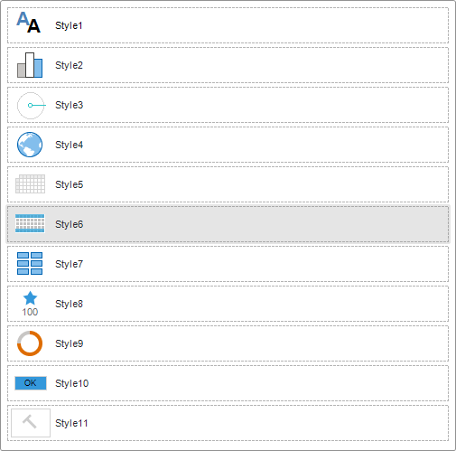
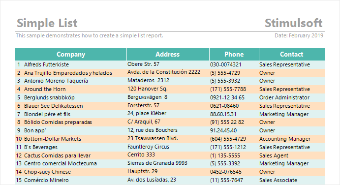

## Styles

The **Style** is a named combination of various design settings. You can create styles and their collections in the designer of styles. A created style can be applied to any component in a report or to an element of a dashboard. If after you create a report it`s needed to change design settings of some components or elements, you should change design settings of an assigned style.

To assign a style to report component or dashboard element, you should:
* Select a component or an element in the report designer;
* Click the **Select Style** button on the **Home** Ribbon tab of the report designer panel and select the style you need in the drop down menu.
* Otherwise, click the **Browse** button for the **Style** property for elements or the **Component Style** property for components.

* Drag and drop style from Style Designer to report or dashboard components.

* **Watermark Style is applied using** **Watermark Style** property of report pages, dashboards and Panel components on the dashboards.

Also, it`s worth noting, that if styles joined into style collection, when applying style collection, styles by conditions will be applied to report components.

> **Information**
>
> It`s worth taking into account, that each component has its own design settings. For example, the **Panel** component doesn`t have design settings of the **Font**. In this case, when using a style this parameter will be ignored. In other words, a component will use only the settings of style design, which it supports.

**Odd Style and Even Style**

You can apply separate styles for even and odd rows for the **Data** band component.

To do that you should:
* Select the **Data** band in the report designer;
* Define a style for the **Odd Style** and **Even Style** properties in the property panel.

By default, these properties are not used. But if you specify appropriate styles in them, when creating a report, the report generator will use specified styles for even and odd rows.

> **Information**
>
> You can apply a style via a row for other components too. It`s easy to do that using conditional formatting of components. To do that you should:
> * Select a component in a report;
>
> * Add conditional formatting;
> * Specify the (Line & 1) == 0 expression as an expression of formatting applying;
> * Select a necessary style as formatting settings.

**Use Parent Styles**
Apart from the Style property, each report component has an additional property of style control – Use Parent Styles. This property allows you to use component style, where it is located. If this property is set to true value, the component style, where it is placed will be applied to the component. If this property is set to False value, an assigned style will be applied to the current component.
