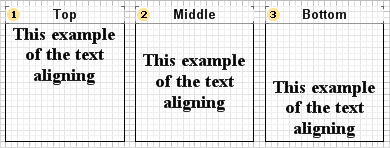
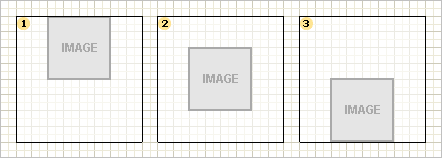

## Vertical Alignment

Alignment vertically defines the position of content relatively to the top and bottom component border. Vertical alignment can be set by the top edge, in the center and by the bottom edge. To change vertical alignment you should use the Vertical Alignment property.

Vertical alignment of text

By default, a text is aligned relatively to the top side. However, if needed you can set the alignment you need and if alignment is set by the bottom side and some text doesn`t fit vertically in component borders, it will be cut by the top side. If alignment is set to center, in case if some text doesn`t fit, it will be cut at the same time by the top and bottom side.

 Top

The text is aligned relatively to the top component border.

 Center

The text is aligned in the center relatively to the top and bottom component border.

 Bottom

The text is aligned relatively to the bottom component border.

Vertical alignment of an image

To control alignment vertically for the Image component you should use the property that you use for the Text component too. An image is aligned only if the Stretch property is set to false. Otherwise, alignment parameters will be ignored.

 Top

The image is aligned relatively to the top component border.

 Center

The image is aligned by the center relatively to the top and bottom component border.

 Bottom

The component image is aligned relatively to the bottom component border.
