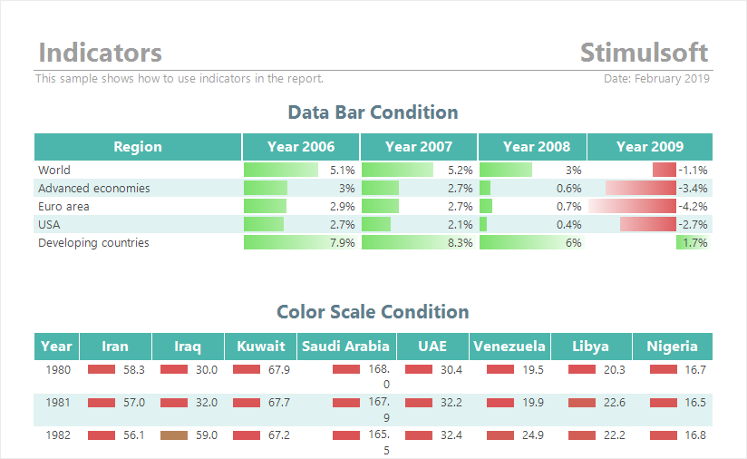

## Appearance

> **YouTube**
>
> Watch our video lessons about [report appearance](https://www.youtube.com/watch?v=HBg6nqKizrI&index=1&list=PL6BCD8C9EBB9CB79E). Subscribe to the [Stimulsoft channel](https://www.youtube.com/user/StimulsoftVideos) and be the first to know about new video lessons. Leave questions and offers in the comments to the video.

Stimulsoft Reports offers you various ways of report appearance.
* Manually, i.e report components design settings are defined manually by a user with the help of component properties;
* Using their styles and collections.

> **Information**
>
> Before applying collections of styles for reports, you should set the [conditions of applying styles](Styles/Style_Conditions.md).

Basic settings of design can be called:
* [Text brush and component background fill;](Background_Brushes.md)

* [Text font;](Fonts_and_Font_Brushes.md)

* [Borders;](Borders.md)

* [Horizontal](Horizontal_Alignment.md) and [Vertical](Vertical_Alignment.md) alignment of component content.
