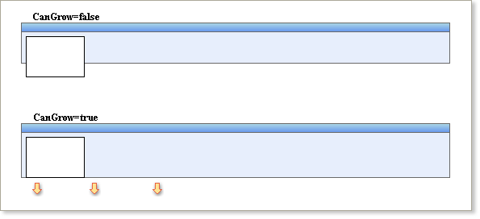
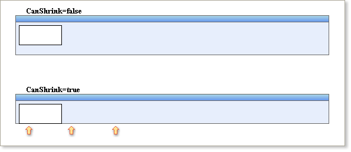

## Automatically Resizing Bands

Because bands are inherited from **Panels**, they change their size in the same way.  The size of the **Band** can be automatically changed depending on the size of components positioned on the band.

**CanGrow Property**

It should be noted that most types of band can only automatically change their height - the exception is cross-bands which change their width. For example, if there is a component on the band which crosses the lower boundary and you set the **CanGrow** property of the band to true, the band height will be automatically increased until the entire component is contained within the band:

**CanShrink Property**

Similarly if there is free space between the boundary of a band and the lower border of the tallest component that it contains and you set the **CanShrink** property to true, the height of the band will automatically be reduced until it matches the lowest point of the lowest contained component:

