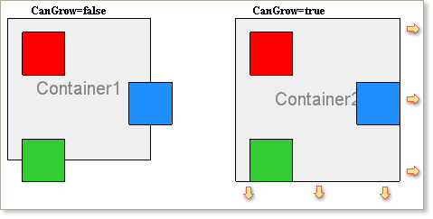
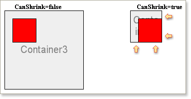

## Automatically Resizing Panels

Because Panels are only containers and output no visual information in the report it may seem that the CanGrow and CanShrink properties have no relevance, but this is not the case.

Panel components may contain other components which have specified sizes and positions. If some of the component positions mean that their boundaries cross the border of the panel then setting the CanGrow property to true will cause the panel container to be automatically resized so that the child components are wholly enclosed within it. The picture below shows how the CanGrow property works:

If the CanShrink property is set to true and the bounds of the combination of all the components contained within it are less than the bounds of the panels the panel size will automatically reduce to match the overall size of all components.

