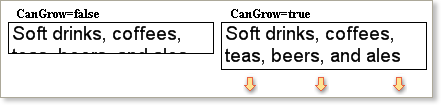
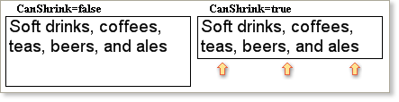
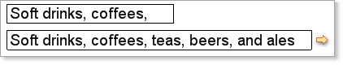

## Automatically Resizing Text Component

The automatic resizing of text components behaves differently from other components. The **CanGrow** and **CanShrink** properties affect only the height of a text component and not the width. The example below shows an example of the **CanGrow** property causing the text height to change:

The **CanShrink** property works in the opposite way, so if it is set to true and there is more space than is needed for the text the report generator will automatically decrease the height of the text component.

As with other components it is possible to set both properties to true. In this case, the height will automatically increase or decrease depending on the size of a text.

**WordWrap Property**

The **WordWrap** property controls whether or not the text in the control automatically wraps when it becomes too long to fit in a single line.  If the **WordWrap** property is set to false then the text is cropped at the border of the component, but when set to true new lines are created until all the text is displayed on multiple lines.

When automatically resizing a text component with the **WordWrap** property set to false the report generator will calculate the new size based on the height of a single line only. If you want the report generator to increase the height of the component based on all the text lines then the value of the **WordWrap**  property should be set to true so that the text automatically wraps and the calculation can be based on the combined height of all the text lines.

**AutoWidth Property**

In addition to the **CanGrow** and **CanShrink** properties the **AutoWidth** property can affect the way a text component changes size. If the **AutoWidth** property is set to true then the text component will automatically change its width to match the width of the text. The **CanGrow**, **CanShrink**, and **AutoWidth** properties can be used simultaneously.

If the **AutoWidth** property is set to false, then the height of the text depends on settings of the **CanGrow** and **CanShrink** properties. If the **AutoWidth** property is set to true, then the width will be automatically changed.

* **Important:** If the **AutoWidth** property is set to false then the height of the text depends on the **CanGrow** and **CanShrink** properties. If the **AutoWidth**  property is set to false then it will change the width of the text.
