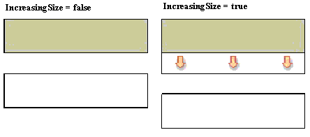
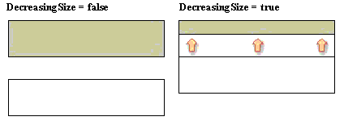
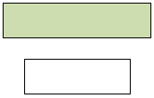
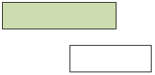
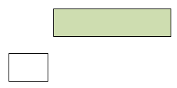

## Automatically Shifting Components

Automatically changing the size of components can lead to a problem when rendering reports - what happens when a change in the size of one component has an adverse effect on another component in the report? For example, if the height of the first component is increased it could overlap a component placed below it.

To prevent this problem the ShiftMode property is used.

ShiftMode Property

The ShiftMode property allows all components with top borders situated below the top border of an automatically modified component to be automatically shifted down the report so that they maintain the same relative position.

The property has three flag values each of which can be set to True or False:

 IncreasingSize

 DecreasingSize

 OnlyInWidthOfComponent.

These work as follows:

IncreasingSize

If this flag is set to true then any increase in the height of the components located above the specified component causes the component to shift down vertically by the same amount. If the flag is set to false then any increase in the height of the higher components is simply ignored, as shown in the example below:

By default this flag is set to true.

DecreasingSize

If this flag is set to true then any decrease the height of the components located above the specified component causes the component to shift up vertically by the same amount. If the flag is set to false then any decrease in the height of the higher components is simply ignored, as shown in the example below:

By default, this flag is set to false.

OnlyInWidthOfComponent

If the flag is set to true, it takes into account changes only to those components that have their left boundary less than the left border of the specified component, and the right border more than the left border of this component as in the examples below:

Or:

If this flag is disabled, the location of the left border of this component is ignored. For example:

By default this flag is disabled.
