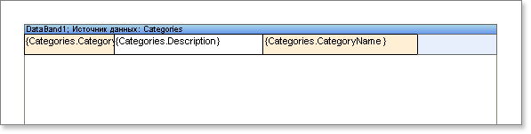
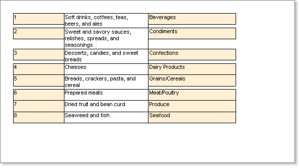
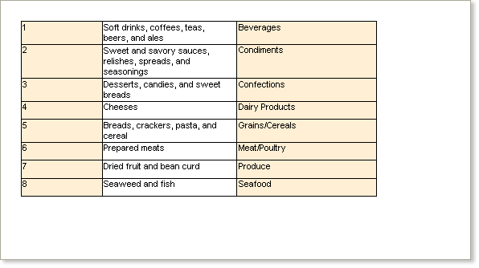

## Binding Bottom Border of Component

Typically there will be more than one component on a band, as in the example shown  below:

When rendering a report the height of some of the components may be changed automatically to suit the size of their contents which can result in unwanted breaks in the layout as shown below:

To prevent this occurring you can bind the bottom border of a component to the lower border of the container in which the component is placed. This binding is done using the GrowToHeight property.

GrowToHeight Property

If you set the GrowToHeight property to true all components that do not change their size will have their bottom borders bound to the bottom border of the container.

* **Note:** The **GrowToHeight** property binds the bottom border of the component to that of its container whether that container is a **Band** or a **Panel** component.

This will give a consistent and much better looking result as shown below:

By default, the GrowToHeight property is set to false.

Handling Multiple Components

If there are multiple components on one band that can automatically change their size it is possible set the GrowToHeight property for all these components to true. This will cause the height of these components to be automatically adjusted based on the height of the tallest component.

* **Note:** The **GrowToHeight** property can be set for components which automatically change their size as well as those that do not. In this case, if the bottom border is not matched to the bottom border of its container the size of this component will be automatically adjusted to suit.
