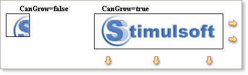
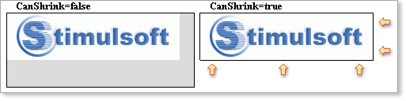
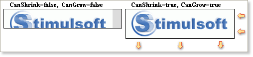

## Autosize

Automatic resizing of components is controlled by two properties available in report components: **CanGrow** and **CanShrink**.

Can Grow

If the **CanGrow** property is set to true the component can automatically increase its size if the information contained within it does not fit in the space available. If it is set to false the information will be cropped to the component size, as in the examples below:

Can Shrink

If the **CanShrink** property is set to true the component can automatically reduce its size so that it fits exactly to the size of the text or image being displayed.  If it is set to false the component remains the same size leaving unused space around the information it contains, as in the examples below.

Using this property will help you to prevent wasted space on report pages

The report generator allows you to set both **CanGrow** and **CanShrink** properties.  If you set both properties to true the component will automatically increase or decrease in size whenever appropriate. The example below shows an image component that is not large enough to support the height of the image but is too wide for the image width. By setting the **CanGrow** and **CanShrink** properties to true the size of the component changes automatically and exactly matches the size of the image.

