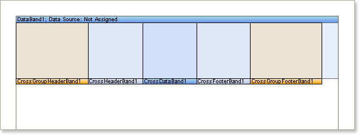

## Cross-Bands

Cross-bands must be placed on a standard band, and thus cannot be directly placed on a page or a container. They are used to enable the rendering of complex cross-reports.

* **Important:** Cross bands occupy the full height of their parent component, so it is not recommended to place them directly on the page. If the band does not fit on one page, it is not wrapped, but a new page segment is added.

Please refer to the list below to see all the cross-bands available in Stimulsoft Reports.

| **Icon** | **Name** | **Description** |
| --- | --- | --- |
|  | Cross-Group Header | This band is printed in the beginning of a group |
|  | Cross-Group Footer | This band is printed in the end of a group |
|  | Cross-Header | This band is printed before data |
|  | Cross-Footer | This band is printed after data |
|  | Cross-Data | This band is printed as many times as there are rows in the data source |

Unlike simple bands, the cross-bands header is displayed at the bottom of a band.

