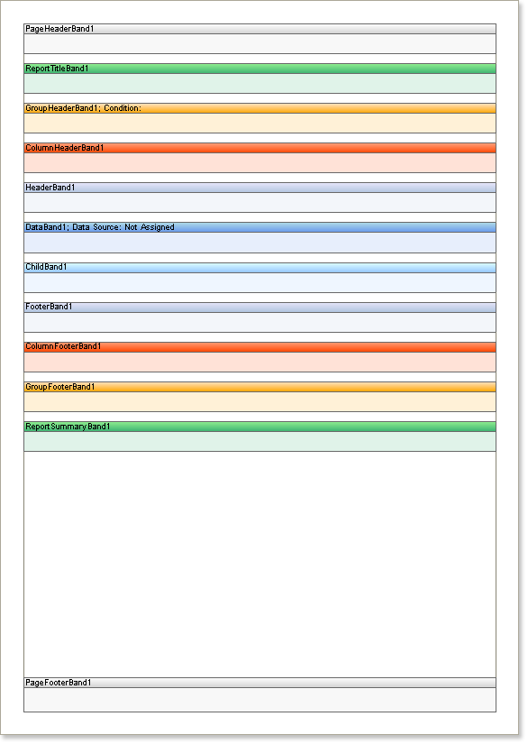

## Standard Bands

Standard bands are the fundamental elements of any report. Please refer to the list below to see all the standard bands.

> **Video**
>
> * NOTE: This article lists the bands that are used to create reports. To familiarize yourself with how they are processed during the report rendering, please read the article [Rendering Order of Bands](../Order_Render.md).

Icon

Band Name

Description

Report Title

This band is printed in the beginning of a report

Report Summary

This band is printed in the end of a report

Page Header

This band is printed on the top of each page

Page Footer

This band is printed on the bottom of each page

Group Header

This band is printed in the beginning of a group

Group Footer

This band is printed in the end of a group

Header

This band is printed before data

Footer

This band is printed after data

Column Header

This band is printed before a column is output

Column Footer

This band is printed after a column is output

Data

This band is printed as many times as there are rows in the data source

Hierarchical Data

This band is printed as many times as there are rows in the data source. Data items are output as a tree

Child

This band is printed only once, after the band beneath which it is placed

Empty Data

Fills the free space at the bottom of a page

Overlay

This band is printed on the background of a page. It does not effect on other bands.

To enhance the clarity and improve the understanding of report structures, each type of band is assigned a specific color in the report template.

