## Rendering Order of Bands

In this article, let's review the process of rendering report bands and define their relationships within the first level of nesting. By the first level of nesting, we mean that the report will not have a hierarchy, but rather consist of simple lists, groups, etc. All bands can be categorized into the following types.

* **Page Header** and **Page Footer**, **Overlay** are page bands. These bands are related to the report pages, and are displayed on each page of the report;
* **Report Title** and **Report Summary** are report bands. As evident from their group name, these bands are interconnected with the report and are used to display the title and summary in reports. They are displayed only once;
* **Data Band**, **Hierarchical Band** are list bands. In the following text, when referring to the Data Band, we also imply that it can be used as a substitute for the Hierarchical Band;
* Bands associated with the **Data Band** are **Header Band**, **Footer Band**, **Group Header Band**, **Group Footer Band**, **Column Header Band**, **Column Footer Band**, **Empty Band**;
* The **Child Band**.

All bands are displayed in the strict order. This is due to the fact that each band has a specific function in the report. And it is very important in which order bands are printed.

Order

Band name

Description

1

Page Header

On each page. Output on the first page is optional.

2

Report Title

Once at the beginning of a report. The Report Title band can be output before the Page Header band if the Title Before Header property of the page on which both bands are placed is set to true.

3

Header,

Column Header

Once before data output (for the Column Header - once for every column. Output on each new page is optional.

4

Group Header

At the beginning of each group. Output on each new page is optional.

5

Data

Once for every row of data.

6

Empty Band

For each empty row on every page of the report.

7

Group Footer

At the end of each group.

8

Footer,

Column Footer

After all data has been output (for the Column Footer - once for every column). Output on each new page is optional.

9

Report Summary

Once at the end of a report.

10

Overlay

Once on every page of the report.

11

Page Footer

On every page. Output on the first page is optional.

> **Information**
>
> Information: Components placed directly on the page (not on any band) are printed first, followed by the bands.

The **Child Band** can be placed on any band except the **Page Header**, **Report Summary**, **Page Footer**. The picture below shows the report page template with the location of bands.

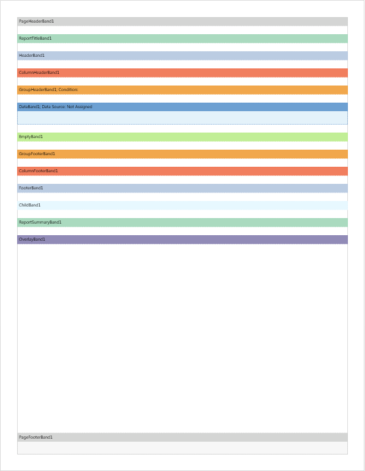

When rendering a report, the report template pages are processed sequentially. The order of page processing is determined by the position of the page in the report tree. The higher the page is in the report tree, the higher is its priority (the sequence) of processing.

For the report tree shown in the picture above, the processing order of the pages will be as follows: the first will be processed **Page1**, then **Page5**, **Page4**, **Page3**, and finally **Page2**. Suppose that all the bands are placed on **Page1** (see an example of the report template page with the location of bands above). In this case, the bands are processed in several steps:

On the first stage go the preliminary analysis of all the bands and the location of the next page bands **PageHeaderBand1**, **PageFooterBand1**, and **OverlayBand1**. These bands will always be primarily processed and added to each new page in the rendering of the report. Also, on the first page of the rendered report the ReportTitleBand1 will be added.

> **Video**
>
> **Notice:** If the **Title Before Header** property is set to true, then the **ReportTitleBand1** will be processed and added to the first page first, and then **PageHeaderBand1**.

In the second stage goes the analysis of other bands.

> **Information**
>
> Information: It should be understood that other bands are in the relationship with the **Data Band**, and their rendering depends on it. So and the **Data Band** is found and analyzed first, and then the other bands.

After the analysis, the report rendering will start. The ReportSummaryBand1 will be processed last.

As mentioned above, all bands (except **PageHeaderBand1**, **PageFooterBand1**, **OverlayBand1**, **ReportTitleBand1**, **ReportSummaryBand1**) in the report rendering depends on the DataBand1. Consider these relationships in more detail and start with a simple example. The **Data Band** is placed on the template page.

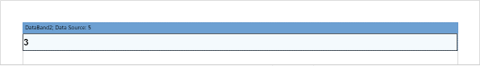

The number of records in the data source is five, and this means that the Data Band is printed 5 times.

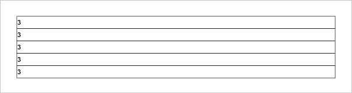

Almost all of the bands can be divided into two categories: **Headers** and **Footers**, for each header corresponds to the same type of Footers.

> **Video**
>
> **Notice:** If there is equal number of headers and footers each header corresponds to its own footer. "Header - Footer" correspondence is considered not from top to bottom of the page but from the data band. Let's say there is one data band, two headers and two footers.

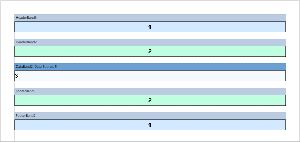

The order of the bands on the page from top to bottom.

Order

Band name

1

HeaderBand3

2

HeaderBand2

3

DataBand2

4

FooterBand3

5

FooterBand2

In this case, the **HeaderBand3** corresponds to **FooterBand2**, and **HeaderBand2** corresponds to **FooterBand3**. In other words, the first header of the data band corresponds to the footer of the first data band. Here is an example of a rendered report.

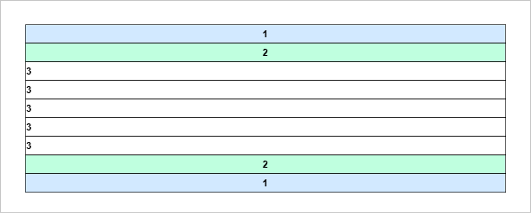

It often happens that the number of headers and footers of a particular type is different. For example, let’s change the example above, adding **HeaderBand4** between **HeaderBand2** and **DataBand2**. Now HeaderBand4 corresponds to **FooterBand3** (color - yellow), **HeaderBand2** - **FooterBand2** (color - turquoise), but the band **HeaderBand3** (color blue) has no footer.

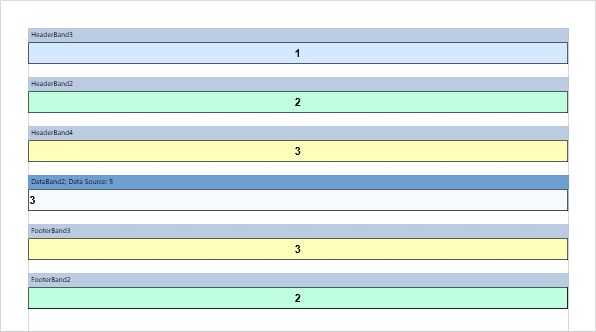

> **Video**
>
> **Notice:** Just headers/footers are output only once before/after the data band and the number of them is not affected on anything. Headers and footers are displayed for each group and each group header strictly corresponds to the footer of the group. In complex reports with different number of headers and footers of the group there may be the erroneous relation with headers and footers. Therefore, we recommend have the same number of bands, headers and footers of the groups in the report template.

> **Information**
>
> Information: In order the band present in the report template but do not appear in a report you should set it height to zero.

For the example above, let’s equalize the number of data headers and footers.

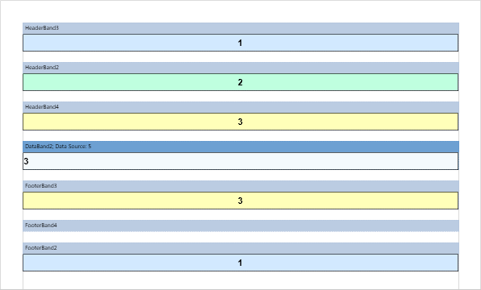

In this case, **HeaderBand4** corresponds to **FooterBand3** (yellow), **HeaderBand2** - **FooterBand4** (turquoise), **HeaderBand3** (blue) - **FooterBand2** (zero height). At the same time, FooterBand4 will not be printed (displayed) in the rendered report.

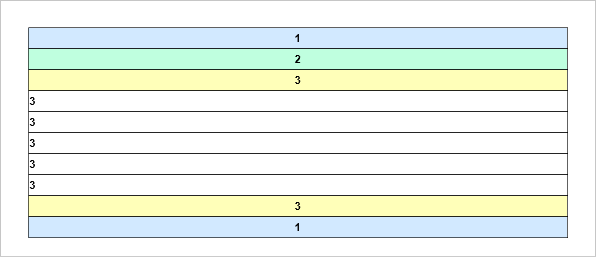

So there is an equal amount of header and footers in the report and it is easy to determine their correspondence. At the same time, you can turn off (do not display) certain bands. All of the examples above were considered for **Header Bands** and **Footer Bands**. The same principle applies to **Group Header Bands**, **Group Footer Bands Column** **Header Bands** and **Column Footer** Bands.

Here is an example below where there are a few data bands in the report.

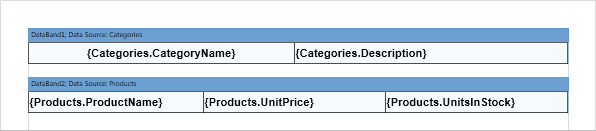

These bands have no connection with each other. Therefore, they are processed sequentially. At first, **DataBand1** (category list) will be processed, and then - **DataBand2** (list of products).

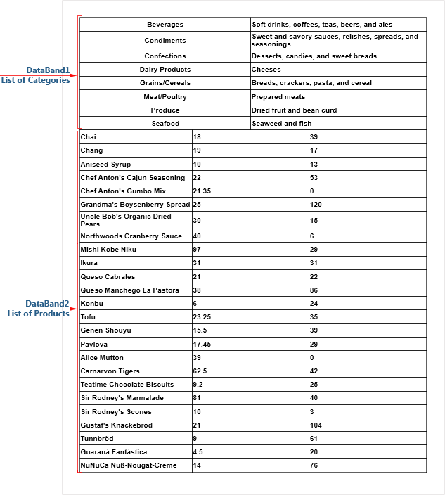

Now add the **Header Band** to the report template. The **Header Band** will refer to the **Data Band** above what it is located. In order the **HeaderBand1** corresponds to **DataBand1** (list of categories), it must be placed above this data band.

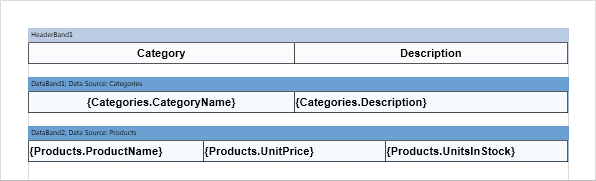

In order **HeaderBand2** be related to **DataBand2** (list of products), it should be placed directly above this **Data Band**.

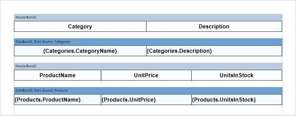

And then the first page of the report will look the following.

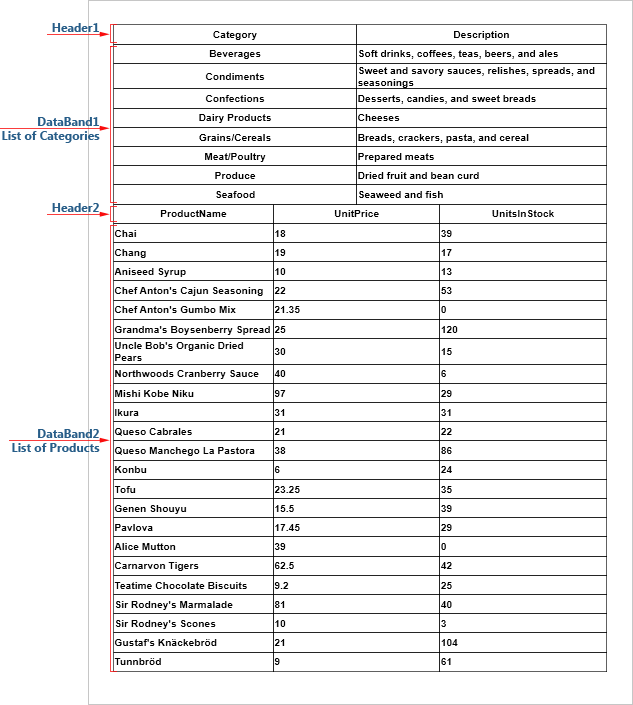

Now consider the relationships of footers and multiple data bands. As mentioned above, footers in the report template refers to this data band and only below of which they are directly positioned. At the same time the **Footer Band** is a closing one to the **Header Band**. Suppose you want to display the total by the number of categories. In this case **FooterBand1** must be placed below the data band with a list of categories but above **HeaderBand2** for a list of products.

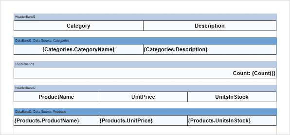

The report page will look the following way.

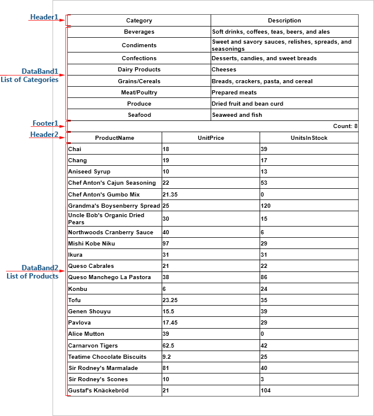

To display the total by the data band with a list of products, **FooterBand2** must be placed below **DataBand2**. For this example, let’s calculate the total cost of all the products using the Sum function. The result will be displayed on each page of the report (set the **Print on All Pages** property to true). Below is a page template with the footer by the data band and the list of products.

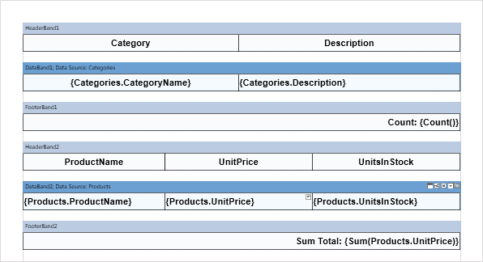

And then the first page of the report will look the following way.

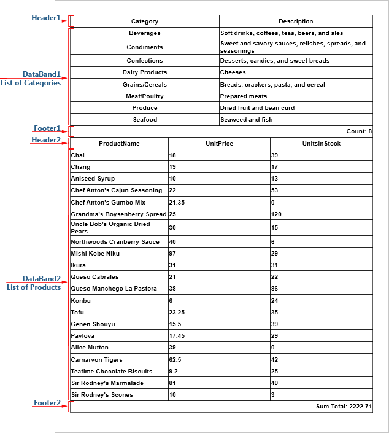

> **Video**
>
> **Notice:** For the example described above, the placement of the **FooterBand1** under the **HeaderBand2** is not quite correct.
>
>
> 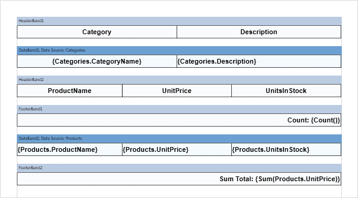
>
>
> In this case, **FooterBand1** and **HeaderBand2** do not refer to any **Data Band**. When rendering a report, all data bands will be defined first. Then, for each data band, headers which relate to this band are defined, all headers located above some footer band or another data band. Footers that relate to this data band are defined next, these are the footers which are placed below the next header or another data band. Therefore, **DataBand1** in the rendered report will be without a footer, **DataBand2** - without a header, and **HeaderBand2** and **FooterBand1** will not be displayed because they do not belong to any of the data bands.
>
>
> 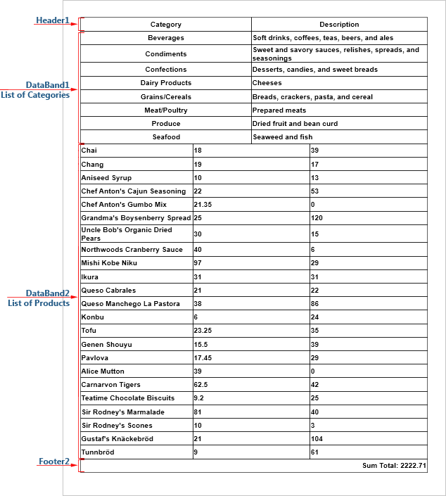

The same principle of correspondence applies to **Group Header Band**, **Group Footer Band**, **Column Header Band**, and **Column Footer Band**.

Headers are placed above the Data Band to which they relate and Footers are placed below. Headers and Footers cannot be printed themselves because they must refer to the specific data band.

Always check the number of headers and footers, particularly in the report with groups. Sometimes it is easier to add a specific band (header or footer) to equalize their number and clearly trace the line. -Set zero height for the band in the report template if you want to hide it in the rendered report.
