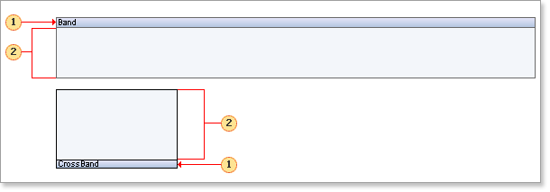

## Bands

Stimulsoft Reports constructs its reports using bands (also referred to as sections in other products). A band consists of two parts: the band header and the working area. The band header displays the name of the band, along with other information and controls that can be shown. Each band serves as a container and can contain other components.

 The band header;

 The band working area.

Bands do not appear in the rendered report; only the calculated content of the bands is displayed. The properties of the band control only determine its position within the rendered report.

Typically, a report will consist of multiple bands with text and images. When a report is rendered, bands are duplicated as needed to complete the report. For instance, the Header band is displayed once before the data, while the Data band is displayed once for each record.
