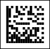

## Datamatrix

The DataMatrix barcode was created by the CiMatrix company to accommodate large amounts of information in a limited surface area. The allowed length depends on the selected barcode size (number of rows and columns). The physical dimensions of a barcode can vary widely: the barcode modulus value can vary from 1 mil to 14 inches (14,000 mil). The most popular applications for the Datamatrix are marking small items such as electronic components and printed circuit boards of electronic devices. Every DataMatrix is composed of two solid adjacent borders in an "L" shape (called the "finder pattern") and two other borders consisting of alternating dark and light "cells" or modules (called the "timing pattern"). Symbol sizes vary from 8×8 to 144×144. The DataMatrix is used to mark small products.

For compatibility of the DataMatrix barcode with GS1, you should to do the following:

* Set the Process Tilde property to true;

* Add the prefix ~FNC1 in the Code field. For example, the expression will be like this: ~FNC1{your_datasource.field_name}.

Data Matrix symbols are rectangular in shape and usually square, they are made of cells: little elements that represent individual bits.

The barcode contains error correction codes so the barcode can be read even if it is partially damaged. There are two main versions of this barcode: the first version is called ECC-000 or ECC-140. The second version is described as ECC-200 version, and uses the Reed-Solomon method for error correction. In Stimulsoft Reports the second version of this barcode is used. Only the second version of the barcode is implemented in Stimulsoft Reports, further description is given only for this version.

The barcode contains error correction codes: even if the barcode is partially damaged, it can still be read. There are two main versions of this barcode. The first uses convolutional coding for error correction; these are the first versions of the Datamatrix code, these versions are described as ECC-000.. ECC-140. The second version of the barcode is described as ECC-200, uses Reed-Solomon error correction, and always contains an even number of elements on each side. Only the second version of the barcode is implemented in Stimulsoft Reports, further description is given only for this version. The barcode consists of black and white square elements, which are joined into square or rectangular regions. Each region has rulers that appear as a solid line along one edge of the symbol (left and bottom) and evenly spaced squares along the other edge (top and right). These rulers are used to determine the orientation and density of the code. If the data does not fit into one region, then several regions are used, which are added vertically and horizontally. Total barcode size can be from 8×8 to 144×144. All available combinations of sizes is shown on the table below:

| Barcode size | Length, bites | Barcode size | Length, bites |
| --- | --- | --- | --- |
| 10 × 10 | 3 | 32 × 32 | 62 |
| 12 × 12 | 5 | 36 × 36 | 86 |
| 8 × 18 | 5 | 40 × 40 | 114 |
| 14 × 14 | 8 | 44 × 44 | 144 |
| 8 × 32 | 10 | 48 × 48 | 174 |
| 16 × 16 | 12 | 52 × 52 | 204 |
| 12 × 26 | 16 | 64 × 64 | 280 |
| 18 × 18 | 18 | 72 × 72 | 368 |
| 20 × 20 | 22 | 80 × 80 | 456 |
| 12 × 36 | 22 | 88 × 88 | 576 |
| 22 × 22 | 30 | 96 × 96 | 696 |
| 16 × 36 | 32 | 104 × 104 | 816 |
| 24 × 24 | 36 | 120 × 120 | 1050 |
| 26 × 26 | 44 | 132 × 132 | 1304 |
| 16 × 48 | 49 | 144 × 144 | 1558 |

The barcode size can be set using the MatrixSize property. If this property is used to specify the specific size of the barcode, then the barcode will be of that fixed size. If this property is set to Automatic (by default), then the minimal size that is necessary to encode the data will be selected from the list. There are 6 types of the of the sizes of rectangular barcode. If it is required to get a square barcode in the Automatic mode, then the UseRectangularSymbols property should be set to false (by default). If the property is set to true, then square and rectangular forms are used.

There are several modes of data encoding, which are used depending on the type of the encoded information. Each mode allows to encode their own set of characters and their own rate of compression.

| Encoding mode | Valid symbols | Bits per symbol |
| --- | --- | --- |
| ASCII | ASCII character 0 to 127 ASCII character 128 to 255 ASCII numeric | 8 16 4 |
| C40 | Upper-case alphanumeric Lower-case letters and punctuation | 5,33 10,66 |
| TEXT | Lower-case alphanumeric Upper-case letters and punctuation | 5,33 10,66 |
| X12 | ANSI X12 | 5,33 |
| EDIFACT | ASCII character 32 to 94 | 6 |
| BASE 256 | ASCII character 0 to 255 | 8 |

The ASCII is the universal mode of data encoding (by default). It allows to encode any characters, but pairs of digits are compressed better and the ASCII values (128-255) are compressed worse. For Upper-case alphanumeric encoding, the C40, X12, Edifact modes are best suited, for Lower-case alphanumeric encoding - Text. Base mode allows you to encode any bytes with the same compression ratio.

A "DataMatrix" barcode.
