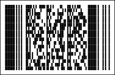

## PDF417

The **PDF417** barcode was developed by Symbol Technologies in 1991. The name of the barcode consists of 2 parts. The PDF comes from Portable Data File. The 417 number comes from the structure of the barcode: each barcode character consists of 17 modules, each of which consists of 4 bars and 1 space.

**PDF417** is a high density 2 dimensional bar code symbology that consists of a stacked set of smaller bar codes. Any ASCII characters can be encoded in this barcode. The length of data depends on the encoding mode and can reach 1100 bytes, or 1800 text characters, or 2600 digits although in practice many scanners do not read more than a thousand characters). Due to the long data length, all necessary information can be stored directly in the barcode, which is why it is called "Portable Data File".

The barcode contains from 3 to 90 rows each of which is like a small linear bar code. Each row has:

* A quiet zone.

* A start pattern which identifies the type of symbol as PDF417.

* A "row left" codeword containing information about the row.

* A "row right" codeword with more information about the row.

* A stop pattern.

* A quiet zone.

The string consists of elementary barcode symbols - patterns. Each line contains 4 service patterns (2 on the left and 2 on the right) and data patterns (from 1 to 30). Each pattern consists of 4 strokes and 4 spaces, with a total width of 17 modules. The pattern can take values from 0 to 928, which are called "codewords" in the specification.

The barcode may have any number of rows and columns (patterns in the data row), although the total number of patterns should not be greater then 928. The number of rows and columns can be set using the DataRows and DataColumns properties. If the AutoDataRows and AutoDataColumns properties are set to false, then the barcode size will be fixed. If one of these properties is set to true, then the barcode size can increased and decreased in this direction depending on data. If both of these properties are set to true, then the size of the barcode is set automatically, considering the "AspectRatio" parameters (the ratio of the barcode width to the barcode height) and RatioY (the height of the code word in modules, from 2 to 5).

It is possible to select one of three modes of data encoding depending on the type of encoded information. Each mode allows to encode has its own set of characters and its own rate of compression.

**Encoding mode**

**Valid symbols**

**Compression**

Byte

ASCII 0 to 255

1,2 bytes per word

Text

ASCII 9,10,13 & 32-127

2 characters per word

Numeric

0123456789

2,9 digits per word

The barcode contains the codes of error corrections: even if the barcode is damaged, it will be read. There are 9 levels of error corrections from 0 (low) to 8 (high) shown in the table below:

Level of Error Correction

Number of Codewords

0

2

1

4

2

8

3

16

4

32

5

64

6

128

7

256

8

512

The higher the error correction level, the more correction codes are added to the barcode. The number of correction codes does not depend on the amount of data. Therefore, with a small amount of data, it is not recommended to set large levels of error correction (the number of correction codes will be ten times greater than the amount of data, i.e., too redundant). To set the level of correction the **ErrorsCorrectionLevel** property can be used. This property can be set to "Auto", in which case the level will be set automatically.

A "PDF417" barcode.
