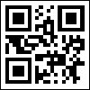

## QR Code

A QR Code (QR is the abbreviation for Quick Response) is a two-dimensional code, readable by QR scanners, mobile phones with a camera, and smartphones. It was created by Toyota subsidiary Denso-Wave in 1994.

QR Code is capable of handling all types of data (look at the table below):

Numeric mode:

0123456789

Maximum 7089 characters

Alphanumeric mode:

ABCDEFGHIJKLMNOPQRSTUVWXYZ

0123456789 $ % * + - . / : space

Maximum 4296 characters

Binary mode (8 bits byte data):

JIS 8-bit (Latin and Kana)

Maximum 2953 bytes

Kanji mode:

Shift JIS (8140H-9FFCH and E040H-EBBFH)

Maximum 1817 characters

The QR Code characteristics:

The barcode size (not including quiet zone): Versions from 1 to 40 (21*21 modules to 177*177 modules, increasing in steps of 4 modules per side)

Four levels of error correction allowing recovery of:

Correction Level

Percentage of the recovered information

Error correction level

L

7%

Level1

M

15%

Level2

Q

25%

Level3

H

30%

Level4

The higher the level of errors correction, the bigger percentage of information of the corrupted barcode can be recovered, but fewer information can be encoded in the barcode of the same size. The image below shows an example of a QR code:

A "QR Code" barcode.
