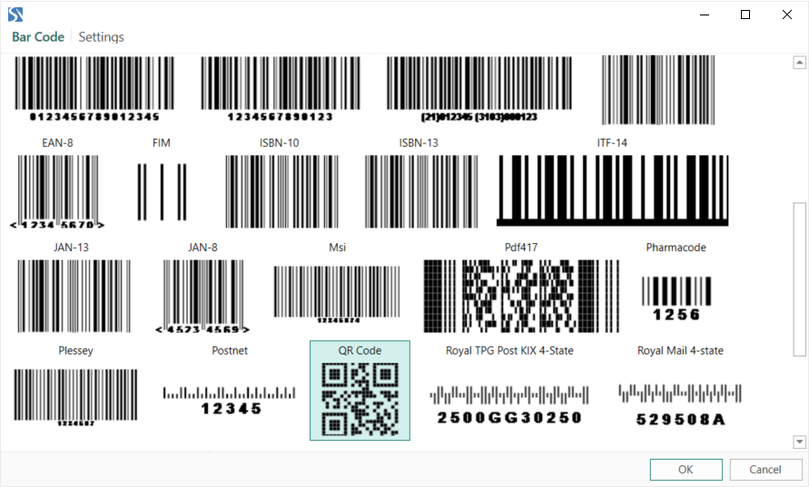
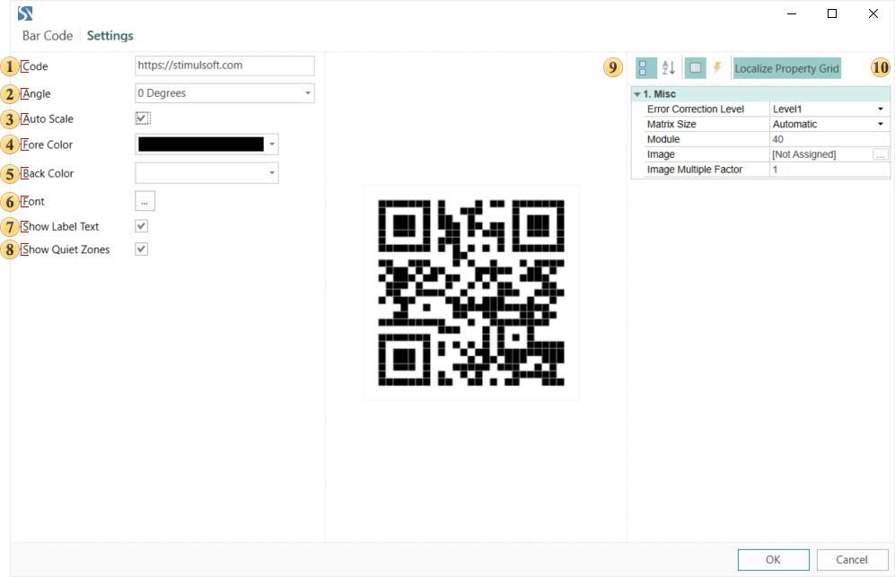
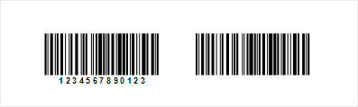
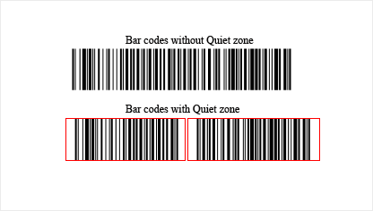

## Barcode Editor

When you add the Barcode component in the report template, the bar code editor is called.

> **Information**
>
> If in the designer settings, the **Edit After Insert** option is disabled (unchecked), then you need to double-click the component to call the editor.

The Barcode editor consists of two tabs:

* The **Bar Code** tab. Select the bar code you need to use in the report. For example, the [QR Code](2D_Barcodes/QR_Code.md):

* Then you should go to the **Settings** tab, and set up the barcode. Set up the barcode. The tabs have three panels: barcode parameters, preview, barcode properties.

> **Information**
>
> In the web report designer, editing the barcode goes using the parameters and properties that are located on the properties panel. They are entirely identical to those described below. In the web report designer, you should select a component, go to the properties panel, and set the component settings. When you double-click the component, you will call a menu in which you need to specify values for the barcode (custom value, data column, variable, etc.).

Consider the barcode parameters in detail:

 The **Code** field. Specifies a value that bar code will have. For example, you can determine a custom value. For the QR Code, it may be some text and numeric value. Also in this field, you can specify an expression. Then, the result of this expression will be the value of the barcode.

 The **Angle** parameter. It provides an opportunity to rotate the graphical barcode information on 90, 180, and 270 degrees.

 The **Auto Scale** parameter. It provides the ability to determine the optimal scale of the bar code, taking into account the volume of information. You should know that the larger is the amount of information in a bar code, the more graphical elements are in it. So, if the bar code contains a large volume of data and, at the same time, you minimize the component size, the barcode reader could misread it. Therefore, the size of the component in the report should always be defined, taking into account the amount of information that the barcode contains.

 The **Fore Color** parameter specifies the color of the graphical elements in the barcode

 The **Back Color** parameter specifies the color of a background in the barcode.

 The **Font** parameter specifies a type and style of the font for the barcode.

 The **Show Label Text** parameter allows showing/hiding the label text of the barcode. This is applicable not for all barcodes but only for those who have a labels. The label shows the value of the barcode. For example, the picture below shows two Code128 barcodes - one with a label, the other without it.

 The **Quiet zone** parameter. It provides the ability to display or hide a quiet zone of a barcode. The Quiet zone is an empty space on the left and right side of the barcode. It is a conditional border of the beginning and end of the barcode for barcode readers. One example of the use of the Quiet zone is the case when there are several barcodes. If the Quiet zone is disabled, then the barcodes can be misread. Below is an example of two barcodes with enabled and disabled Quiet zones.

 The preview panel.

 The Barcode property panel. Depending on the barcode type, the number of properties and their names may vary.
