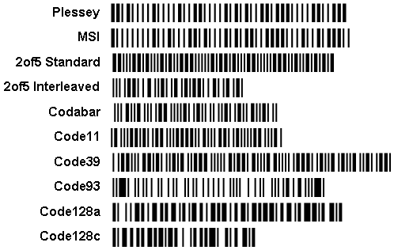
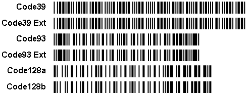
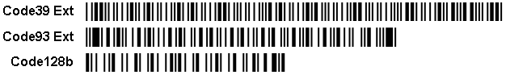

## Barcode Comparison Table

The table below shows the list of linear barcodes supported by Stimulsoft Reports.

-

Type

Length

Check

symbols

Checksum

algorithm

0-9

A-Z

a-z

other symbols

UPC-A

12

1

modulo-10

+

UPC-E

8

1

modulo-10

+

EAN-13

13

1

modulo-10

+

EAN-8

8

1

modulo-10

+

EAN-128a

var

1

modulo-103

+

+

ASCII 0 to 95

EAN-128b

var

1

modulo-103

+

+

+

ASCII 32 to 127

EAN-128c

var

1

modulo-103

+

ITF-14

14

1

modulo-10

+

JAN-13

13

1

modulo-10

+

JAN-8

8

1

modulo-10

+

ISBN-10

10

1

modulo-10

+

ISBN-13

13

1

modulo-10

+

Pharmacode

1..6

-

-

int 3..131070

Plessey

var

0-2

modulo-10/11

+

A B C D E F

Msi

var

0-2

modulo-10/11

+

2of5 Standard

var

-

-

+

2of5 Interleaved

var

-

-

+

FIM

1

-

-

A B C D

Codabar

var

-

-

+

- $ : / . +

Postnet

5, 9, 11

1

modulo-10

+

Australia Post

10[+var]

4

ReedSolomon

+

Code 11

var

0-2, A

modulo-11

+

-

Code 39

var

0-1

modulo-43

+

+

- . $ / + % space

Code 39 ext

var

0-1

modulo-43

+

+

+

full ASCII

Code 93

var

2

modulo-47

+

+

-.$/+% space

Code 93 ext

var

2

modulo-47

+

+

+

full ASCII

Code128a

var

1

modulo-103

+

+

ASCII 0 to 95

Code128b

var

1

modulo-103

+

+

+

ASCII 32 to 127

Code128c

var

1

modulo-103

+

Explanation:

 "Length" - is the data length, it is the number of characters, which can the barcode can encode; "var" means the variable length.

 "Check symbols" - possible number of check digits; "A" means that number of check digits can be chosen automatically.

 "Checksum algorithm" - the algorithm for calculating check digits. The information is provided for general information only.

 "0-9", "A-Z", "a-z" - ranges of symbols; + means that the barcode can encode characters of this range.

 "other symbols" - this column indicates other characters that can be encoded by the barcode, and which are not included in the previous three ranges.

Barcode Sizes

Below is a comparison of barcodes of variable length, which can encode the numbers from 0 to 9. All barcodes have the same input data - the row of numbers "0123456789» ("ABCDEFGHIJK"), and the same module 20, other parameters set by default.

The image shows: if you need to select a barcode with the minimum size, then when encoding only numbers, 2of5Interleaved and Code128 barcodes are more suitable.

Coding English Uppercase Letters

Below is a comparison of the barcodes of variable length which can encode uppercase English letters. All barcodes have the same input data - the row has "ABCDEFGHIJK", and the same module 20, other parameters set by default. The image shows: if you need to select a barcode with the minimum size, then when encoding numbers and capital English letters, Code 93 and Code128a / Code128b barcodes are more suitable.

Coding English Lowercase Letters

Below is a comparison of the barcodes of variable length, which can encode lowercase English letters. All barcodes have the same input data - the row has "abcdefghijk", and the same module 20, other parameters set by default.

The image shows: if you need to select a barcode with the minimum size, then when encoding numbers and upper and lower English letters, the Code128b barcode is more suitable.
