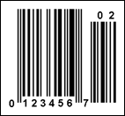
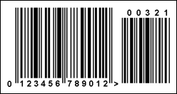

## Add-On Symbols

**Add-on Symbols** (barcodes) can be used in some applications together with the EAN-13, UPC-A, and UPC-E barcodes. Add-on Symbols may contain 2 or 5 additional digits and are usually placed to the right of the main barcode.

| **Valid symbols:** | 0123456789 |
| --- | --- |
| **Length:** | fixed, 2 or 5 characters |
| **Check digit:** | no |

Additional characters contain a left margin character and barcode characters separated by a delineator character. Additional characters do not contain the right margin character and check digit. For self-checking of the barcode, the numbers are encoded with variable parity according to special rules.

**The "UPC-E" barcode with the "02" Add-On Symbols**

**The "EAN-13" barcode with the "00321" Add-on Symbols**
