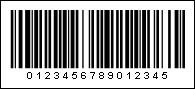

## EAN-128

The **EAN-128** barcode is a subset of the Code128 barcode. It is a variable length, continuous bidirectional checkable code. It can display 128 ASCII characters and is especially efficient for numbers. Information can be encoded using three character sets, but four types of barcodes are distinguished: EAN-128a, EAN-128b, EAN-128c and EAN-128auto (automatically switches between barcodes **EAN-128a**, **EAN-128b**, **EAN- 128c** for encoding ASCII values). A distinctive feature of the "c" character set is the ability to encode one hundred pairs of numbers, which makes it possible to double the recording density when encoding digital data.

| **Valid symbols:** | EAN128a: ASCII character 0 to 95 EAN128b: ASCII character 32 to 127 EAN128c: pairs of digits from 00 to 99 |
| --- | --- |
| **Length:** | Variable |
| **Check digit:** | one, modulo-103 algorithm |

The structure of the **EAN-128** barcode is the same as for the **Code128** barcode. Elements of the barcode consist of three bars and three spaces. Bars and spaces have module construction and their width consists of either one or four modules. The width of an element consists of eleven modules. An exception is the Stop sign, which consists of thirteen modules and has four dashes and three spaces. The check digit is calculated automatically and is not shown in the barcode signature.

To differ the **EAN-128** barcode and the **Code128** barcode is that the FNC1 should be placed after the start character. This character is reserved for the EAN.UCC system.

**An "EAN-128c" barcode.**

> **Information**
>
> The 'human readable' digits at the foot which can be used by operators if the label becomes damaged or will not scan for some reason -  "0123456789012345" is the number encoded in the barcode.
