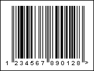

## EAN-13

The EAN-13 barcode was created based on the UPC-A barcode as an extension of the EAN.UCC system used outside the USA. EAN-13 is the European version of UPC-A. The EAN-13 is a high density, fixed length continuous code. It is used primarily in trade, for labeling goods that will be sold through retail.

Valid symbols:

0123456789

Length:

fixed, 13 characters

Check digit:

one, modulo-10 algorithm

The structure of EAN-13 barcode is the same as UPC-A. Each barcode character consists of 2 bars and 2 spaces, which may have a width from 1 to 4 modules. The first digit is always placed outside the symbol, additionally the right quiet zone indicator (>) is used to indicate the Quiet Zones that are necessary for barcode scanners to work properly. In addition, the barcode contains three pairs of elongated strokes: the border marks on the left and right of the barcode and the center separator mark. Three combinations of codes are used to self-check the barcode when encoding characters: the left part of the barcode is encoded by the first and second combinations with variable parity, depending on the thirteenth digit; the right part is coded by the third combination with even parity. The check digit is calculated automatically regardless of the input data.

The barcode contains the following data:

 2 (3) digits - country code.

 5 (4) digits - manufacturer code.

 5 digits - product code.

 1 digit - check digit.

This way a barcode does not contain any information about characteristics of a product, but only a unique number relating to an entry in the International data base where all information about the particular product is stored.  An example barcode in EAN-13 format:

An "EAN-13" barcode.

> **Information**
>
> The 'human readable' digits at the foot which can be used by operators if the label becomes damaged or will not scan for some reason - "123456789012" is the number encoded in the barcode.
