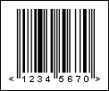

## EAN-8

The EAN-8 barcode was developed to use on small packages. It is used in the place of the EAN-13 barcode if the nominal size EAN-13 barcode covers more than 25% of the printed surface of the package, for example on the packets of gum.

Valid symbols:

0123456789

Length:

fixed, 8 characters

Check digit:

one, modulo-10 algorithm

The structure of the EAN-8 barcode is in the same as the structure of the EAN-13 barcode. The check digit is calculated automatically irrespective of input data.

The barcode contains the following data:

 3 digits - a prefix of the national organization.

 4 digits - product code.

 1 digit - check digit.

This barcode does not contain the code of the producer and has only 4 digits. As a result there can only be 10000 specimen products per  organization, so the EAN-8 barcode is provided only to those organizations which really need it.

An "EAN-8" barcode.

> **Information**
>
> The 'human readable' digits at the foot which can be used by operators if the label becomes damaged or will not scan for some reason - "12345670" is the number encoded in the barcode.
