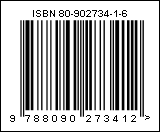

## ISBN-10

ISBN stands for International Standard Book Number, i.e. International Standard Book Number. ISBN is a unique, machine-readable identification number that uniquely identifies a book. The book number began to be used from 1966, first as a 9-digit book code (SBN) published in Britain, and from 1970 it was extended to 10 digits and became international.

Valid symbols:

0123456789

Length:

Not variable, 10 symbols

Check digit:

One

The ISBN, assigned to books until 2006 contained 10 digits length and consist of four fields of variable length:

 For a 13 digit ISBN, a GS1 prefix: 978 or 979.

 The group identifier, (language-sharing country group).

 The publisher code.

 The item number.

  A checksum character or check digit.

An "ISBN-10" barcode.

> **Information**
>
> The 'human readable' digits at the foot which can be used by operators if the label becomes damaged or will not scan for some reason - "80-902734-1-6" is the number encoded in the barcode.
