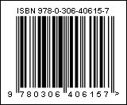

## ISBN-13

On January 1, 2007, a new ISBN standard came into force, adding a fifth group of digits and once again extending the number, now to 13 digits. The change was required in order for the ISBN to be directly used as a standard product barcode. For this, the digits 978 or 979 were added to the beginning of the ISBN, and the checksum calculation algorithm was changed. All previously assigned ISBNs are unambiguously converted to new ones (978 + first 9 digits of the old ISBN + check digit calculated according to EAN-13).

| Valid symbols: | 0123456789 |
| --- | --- |
| Length: | fixed, 13 symbols |
| Check digit: | one, algorithm modulo-10 |

The ISBN assigned to books after 2006 contained 13 digits length and consist of four fields of variable length:

 prefix: 978 or 979.

 The group identifier, (language-sharing country group).

 The publisher code.

 The item number.

 A checksum character or check digit.

A "ISBN-13" barcode.

> **Information**
>
> The 'human readable' digits at the foot which can be used by operators if the label becomes damaged or will not scan for some reason - "978-0-306-40615-7" is a number encoded in the barcode.
