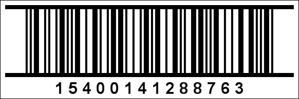

## ITF-14

The **ITF-14** barcode was developed to encode a Global Trade Item Number. In comparison with the EAN/UPC barcodes, the ITF barcode has the nominal size of (152*44mm) and lower requirements for the printing surface. Therefore, it can be printed not only on a label but directly onto a packing carton.

| **Valid symbols:** | 0123456789 |
| --- | --- |
| **Length:** | fixed, 14 characters |
| **Check digit:** | one, modulo-10 algorithm |

Each barcode character is encoded with the help of two broad and three narrow bars/spaces. The ITF-14 will always encode 14 digits. Barcode characters are encoded in pairs of two, respectively, the first character of the pair is encoded by barcodes, and the second character of the pair is encoded with spaces. Hence the name of the barcode "2 of 5 alternating".

The barcode contains the following data:

 1 digit - logic.

 3 digits - Global Trade prefix.

 6 digits - Producer code.

 3 digits - Product code.

 1 digit - Check digit.

**An "ITF-14" barcode.**

> **Information**
>
> The 'human readable' digits at the foot which can be used by operators if the label becomes damaged or will not scan for some reason - "15400141288763" is the number encoded in the barcode.
