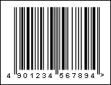

## JAN-13

A JAN-13 barcode is another name for an EAN-13  barcode dedicated for use only in Japan. The first two digits should be 45 or 49 which indicate Japan.

A "JAN-13" barcode.

> **Information**
>
> The 'human readable' digits at the foot which can be used by operators if the label becomes damaged or will not scan for some reason - "4901234567894" is the number encoded in the barcode.
