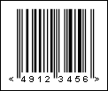

## JAN-8

A **JAN-8** barcode is another name for an EAN-8 barcode dedicated for use only in Japan. The first two digits of the barcode should be 45 or 49 to indicate Japan.

**A "JAN-8" barcode.**

> **Information**
>
> The 'human readable' digits at the foot which can be used by operators if the label becomes damaged or will not scan for some reason - "49123456" is a number encoded in the barcode.
