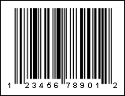

## UPC-A

**UPC-A** was the first barcode, created by Uniform Code Council, Inc. in 1973. The **UPC-A** barcode is an unbroken code with a fixed length and high density. It is used for tracking trade items in stores, and otherwise marking goods. It is used primarily in trade, for labeling goods that will be sold through retail.

| **Valid symbols:** | 0123456789 |
| --- | --- |
| **Length:** | fixed, 12 characters |
| **Check digit:** | one, modulo-10 algorithm |

Each barcode symbol consists of two bars and two spaces, which can be from one to four modules wide. In addition, the barcode contains three pairs of elongated strokes: the border marks on the left and right of the barcode and the center separator mark. For self-checking the barcode when encoding characters, two combinations of codes are used: the left part of the barcode (six characters) is encoded by the first combination with an odd number of dark units of strokes (odd parity); the right-hand side is coded by the second combination of codes with an even number of dark units of strokes (even parity). The check digit is calculated automatically regardless of the input data.

A barcode contains the following data:

* 1 digit - system number.

* 5 digits - manufacturer code.

* 5 digits - product code.

* 1 digit - check digit.

This way a barcode does not contain any information about characteristics of a product, but only a unique number relating to an entry in the International data base where all information about the particular product is stored.  An example barcode in **UPC-A** format:

**UPC-A Barcode**

> **Information**
>
> The 'human readable' digits at the foot which can be used by operators if the label becomes damaged or will not scan for some reason - "123456789012" is the number encoded in the barcode.
