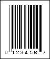

## UPC-E

A UPC-E is a smaller seven digit UPC symbology for number system 0. For UPC-E barcodes, normally 6 digits are specified and the barcode calculates the seventh check digit. It can only be used to write a 12-digit identification code that starts with zero and contains a sequence of four or five zeros at specific positions (see General EAN.UCC Specifications for details). In accordance with the rules from the specification, a 12-digit code is converted into an 8-digit one, which is written into the barcode. In Stimulsoft Reports, this place is simplified - an 8-digit code must be submitted as data, and the check digit is not checked.

| Valid symbols: | 0123456789 |
| --- | --- |
| Length: | fixed, 8 characters |
| Check digit: | one, modulo-10 algorithm |

Before the Middle guard bars, a binary 1 is indicated by a bar, while a 0 is indicated by a space. After the Middle guard bars, however, the patterns are optically inverted. In other words, a 1 is now indicated by a space, and a 0 is now indicated by a bar. It has the same basic structure as the UPC-A barcode.

A "UPC-E" barcode.

> **Information**
>
> The 'human readable' digits at the foot which can be used by operators if the label becomes damaged or will not scan for some reason - "1234567" is the number encoded in the barcode.
