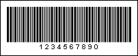
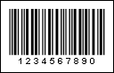

## 2of5

The **2of5** barcode was developed 40 years ago. This is a low density variable length numeric. This barcode is used in manufacture and is known as Code 25, Code 25 Standard or Code 25 Industrial. It is very seldom used these days.

| **Valid symbols:** | 0123456789 |
| --- | --- |
| **Length:** | Variable |
| **Check digit:** | no |

**A "2of5 Standard" barcode. "1234567890" is a number encoded in the barcode.**

The 2of5 Interleaved barcode is a high density variable length barcode developed from the 2of5 Standard barcode. It is used in many fields to encode digital data and is the international standard code for the marking and packaging of shipping units.

| **Valid symbols:** | 0123456789 |
| --- | --- |
| **Length:** | Variable, even |
| **Check digit:** | No |

Characters are coded in pairs. The first character of a pair is encoded with the width of the strokes, the second character of the pair is encoded with the width of the spaces that separate these strokes. Therefore, the barcode is called interleaved and has a higher density than 2of5 Standard. If the number of characters is odd, "0" is automatically added in front.

**A "2of5 Interleaved" barcode. "1234567890" is a number encoded in the barcode.**
