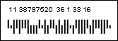

## Australia Post 4-State

The Australia Post 4-Stage barcode is used in Australia for the purposes of sorting and directing letters.

| Valid symbols: | 0123456789 |
| --- | --- |
| Length: | FCC - fixed, 2 characters, DPID - fixed, 8 characters, CustomerInfo variable |
| Check digit: | Four, ReedSolomon algorithm |

The barcode consists of 4 elements (4 conditions), each has its own name, value and display. Each element consists of two bars and two spaces. Each barcode contains 4 check symbols, calculated by the ReedSolomon algorithm. The value of these symbols are usually printed after the text of the barcode.

The string may contain the following parts:

 FCC ("Format Control Code"), 2 digits. May have the following values 11, 45, 87, 92, 59, 62, 44.

 DPID ("Delivery Point Identifier" or "Sorting Code"), 8 digits.

 CustomerInfo may contain 0-9, A-Z, a-z, # symbols and space. The maximal length depends on FCC:

Notes:

If FCC = 11, 45, 87, 92 then the CustomerInfo in ignored.

If FCC = 59 then the CustomerInfo may contain 8 digits or 5 letters/digits.

If FCC = 62, 44 then the CustomerInfo may contain 15 digits or 10 letters/digits.

A "Australia Post 4-state" barcode. "1138797520" is a number encoded in the barcode.
