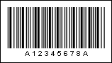

## Codabar

The Codabar is a simple linear barcode symbology developed in 1972. It can be called as NW-7, USD-4, Code 2 of 7 (2 values of a bar length, 7 elements). It is frequently used in medicine (for example, blood bank forms).

Valid symbols:

0123456789 - $ : / . +

ABCD (only as start/stop symbols)

Length:

Variable

Check digit:

no

Four bars and three spaces are used for encoding. The characters are separated by a space the width of which is a narrow stroke. The barcode has four different sets of start/stop characters: A, B, C, D. These characters are used only as start/stop characters and should not be appeared in the barcode.

A "Codabar" barcode. "A12345678A" is a number encoded in the barcode.
