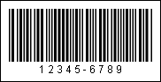

## Code11

The **Code 11** barcode was developed by **Intermec** in 1977. It is used in telecommunications.

| **Valid symbols:** | 0123456789 - |
| --- | --- |
| **Length:** | Variable |
| **Check digit:** | None, one or two; modulo-10 algorithm |

This barcode has high density and can encode any length string consisting of the digits 0-9 and the dash character. The **Code 11** uses one or two check digits and two check symbols. Usually, if the length of the string is less than 10 symbols then only one check symbol is used. If the length of the string is 10 symbols and more then 2 check symbols are used. The value of the check symbol is calculated by the modulo-10 algorithm.

**A "Code 11" barcode. "12345-6789" is a number encoded in the barcode.**
