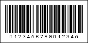

## Code128

The Code128 barcode was developed in 1981. It is a variable length, high density, alphanumeric symbology. It allows to display the 128 characters of ASCII and it is effective for digits. Information can be encoded using three sets of symbols, respectively, four types of bar codes are distinguished: Code128a, Code128b, Code128c, and Code128auto (automatically switches between Code128a, Code128b, Code128c barcodes to encode ASCII values). A distinctive feature of the "c" character set is the ability to encode one hundred pairs of numbers, which allows twice the recording density when encoding digital data.

| Valid symbols: | Code128a: ASCII character 0 to 95 Code128b: ASCII character 32 to 127 Code128c: pairs of digits from 00 to 99 |
| --- | --- |
| Length: | Variable |
| Check digit: | One, algorithm modulo-103 |

The barcode elements consist of three bars and three spaces. Bars and spaces have module construction and their width consist of one or four modules. The width of an element consist of eleven modules. The "Stop" sign, which consists of 13 modules and has four bars and three spaces. The check sum is calculated automatically and is not shown in the barcode signature.

A "Code128c" barcode. "0123456789012345" is a number encoded in the barcode.
