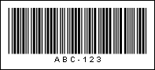
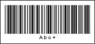

## Code39

Code 39 is a variable length symbology that can encode 44 characters. Code 39 is the most popular symbology in the non-retail world and is used extensively in manufacturing, military, and medicine applications. In addition, this code is used by most car manufacturers as a code to mark a car model and its parts.

Valid symbols:

0123456789

ABCDEFGHIJKLMNOPQRSTUVWXYZ

-.$/+% space

Length:

Variable

Check digit:

No, according to the specification;

In practice - one, modulo-43 algorithm

The Code 39 barcode can encode capital letters (A to Z), numbers (0 to 9) and a group of special characters. Each Code 39 bar code has a start/stop character represented by an asterisk (*). The barcode code does not contain the check character but can be added programmatically. Each character starts and stops with a 'dark bar' that consists of 5 dark and 4 bright bars. The ratio between narrow and wide bars may range from 2.2:1 to 3:1.

Perhaps the main disadvantage of the Code 39 barcode is its low data density. It requires more free space than Code 128, but the Code 39 barcode is still widely used and can be identified by any barcode scanner.

A "Code 39" barcode. "ABC-123" is a number encoded in the barcode.

Code 39 extended is the version of the Code 39 barcode which also supports the ASCII set of characters. The 0-9, A-Z, "." and "-" characters are encoded the same as of the Code 39 barcode. Small Latin letters, additional punctuation, and control characters are represented as sequences of two Code 39 characters.

A "Code 39 extended" barcode. "Abc+" is a number encoded in the barcode.

> **Information**
>
> Barcode scanners cannot differentiate between the Code 39 and the Code 39 extended barcodes. It is necessary to select the correct barcode either by setting a property on the scanner or programmatically.
