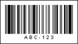
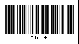

## Code93

The **Code 93** is a variable length symbology that can encode the complete 128 ASCII character set. This barcode was developed as an enhanced version of the Code 39 barcode. It has a higher density than either the Code 39 or the Code 128 barcode.

| **Valid symbols:** | 0123456789 ABCDEFGHIJKLMNOPQRSTUVWXYZ -.$/+% space |
| --- | --- |
| **Length:** | Variable |
| **Check digit:** | Two, algorithm modulo-47 |

The Code 93 barcode may encode Latin letters (from A to Z), digits (from 0 to 9) and a group of special characters. The barcode always contains two check characters. Each characters consist of nine modules which are joined in 3 groups (hence the name - Code 93). Each group has one black bar and one white bar.

**A "Code 93" barcode. "ABC-123" is a number encoded in the barcode.**

**Code 93 extended** is a version of the **Code 93** barcode that supports a set of ASCII characters. All additional symbols are encoded as a sequence of two **Code 93** characters. The first character is always one of four special characters. Therefore, scanners can always identify the different versions of the barcode.

**A "Code 93 extended" barcode. "Abc+" is a number encoded in the barcode.**
