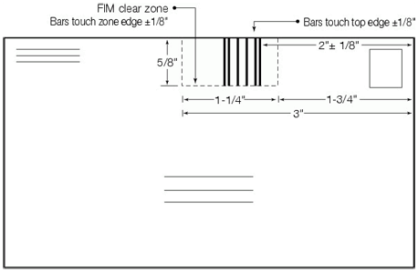

## FIM

Facing Identification Mark (FIM) is the type of postal bar code developed and used in automated mail processing by the U.S. Postal Service. FIM is a set of vertical bars. FIM patterns are placed in the upper right corner along the top edge and two inches in from the right edge of letters and cards, to the left of the location of a postage stamp or equivalent. FIM is intended for usage primarily on branded envelopes and postcards and is used by the envelope or postcard company and not by the Postal Service.

The FIM barcode on a card

The table below shows basic parameters of the FIM barcode.

| Valid symbols: | ABCD |
| --- | --- |
| Length: | Fixed, 1 symbol |
| Check digit: | No |

The FIM barcode consists of nine elements. Each element can be 1 (vertical bar) or 0 (space). Four barcodes are used:

FIM A: 110010011

FIM B: 101101101

FIM C: 110101011

FIM D: 111010111

So the data row should contain 1 of 4 available characters: A, B, C, D.

A "FIM C" barcode
